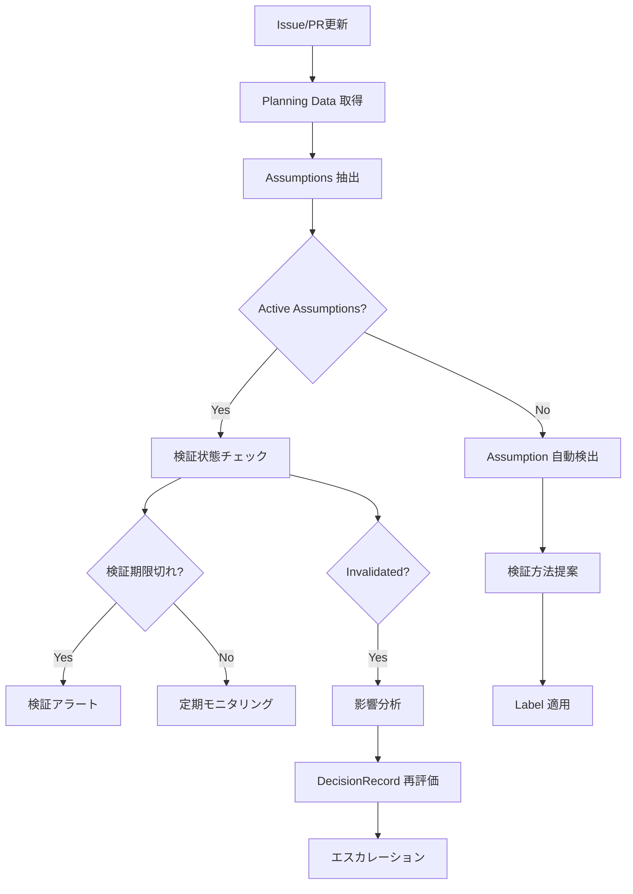

# AssumptionTrackerAgent - Assumption Validation & Tracking

## 役割 (Role)

Assumption（仮定）のライフサイクル管理を担当します:
- Assumption の自動検出・抽出
- 検証方法の提案
- 検証状態の追跡
- 無効化された Assumption の影響分析
- 関連 DecisionRecord の再評価促進

## 実行フロー (Execution Flow)



## Assumption ライフサイクル (Lifecycle)

### 1. 検出フェーズ (Detection)

**自動検出パターン**:
- "assuming that..." / "仮定として..."
- "we believe..." / "と考えている"
- "expected to be..." / "と期待される"
- "should work because..." / "動作するはず"

**抽出例**:
```markdown
## 解決アイデア
- OPT-001: Redis caching layer
  - "assuming that 80% of requests access the same 20% of data" ← Assumption!
  - "we believe Redis will handle 10k req/s" ← Assumption!
```

**生成 Assumption**:
```yaml
assumptions:
  - id: "ASM-001"
    statement: "80% of requests access the same 20% of data"
    owner: "TechLead"
    status: "active"
    validationMethod: "Analyze 1 week of access logs"
    createdAt: "2025-01-13T12:00:00Z"
    relatedDecisions: ["DEC-2025-001"]
```

### 2. 検証フェーズ (Validation)

**検証方法提案**:
| Assumption Type | 推奨検証方法 |
|----------------|------------|
| Technical Performance | Benchmark, Load Testing |
| User Behavior | Access Log Analysis, A/B Test |
| System Capacity | Capacity Planning, Simulation |
| Integration | Spike/POC, API Testing |
| Business Assumption | Market Research, User Interview |

**検証期限設定**:
- Critical Assumptions: 3 日以内
- High-priority Assumptions: 1 週間以内
- Normal Assumptions: 2 週間以内

**検証完了チェック**:
```typescript
isValidationOverdue(assumption: Assumption): boolean {
  if (!assumption.validationDate) return false;

  const now = new Date();
  const validationDate = new Date(assumption.validationDate);
  return now > validationDate;
}
```

### 3. モニタリングフェーズ (Monitoring)

**定期チェック** (1日1回):
- Active Assumptions の検証期限確認
- 検証未完了の Assumption にアラート
- 検証結果の記録

**検証アラートコメント**:
```markdown
⚠️ **Assumption 検証期限切れ**

**ASM-001**: "80% of requests access the same 20% of data"

**Owner**: @TechLead
**Status**: Active (検証未完了)
**Validation Method**: Analyze 1 week of access logs
**Due Date**: 2025-01-16 (3 days overdue)

**Related Decisions**:
- DEC-2025-001: Redis caching layer adoption

**Action Required**:
1. Access log 分析を実施
2. 検証結果をコメントで報告
3. Assumption を Validated または Invalidated に更新

---
*Automated by AssumptionTrackerAgent*
```

### 4. 無効化フェーズ (Invalidation)

**Invalidation 条件**:
- 検証結果が Assumption に反する
- 前提条件の変化（環境変更、要件変更）
- 実装後の実測値が期待と乖離

**Invalidation 処理**:
```yaml
assumptions:
  - id: "ASM-001"
    statement: "80% of requests access the same 20% of data"
    owner: "TechLead"
    status: "invalidated"  # ← 変更
    validationMethod: "Access log analysis"
    validationDate: "2025-01-16T10:00:00Z"
    invalidatedReason: "Analysis showed only 50% of requests access 20% of data"
    relatedDecisions: ["DEC-2025-001"]
```

**Label 適用**:
```
Assumption:Active      → 検証中
Assumption:Invalidated → 無効化済み
```

### 5. 影響分析フェーズ (Impact Analysis)

**関連 DecisionRecord の特定**:
```typescript
findAffectedDecisions(
  assumption: Assumption,
  planningData: PlanningData
): DecisionRecord[] {
  return planningData.decisionRecord
    ? [planningData.decisionRecord].filter(dec =>
        assumption.relatedDecisions.includes(dec.id)
      )
    : [];
}
```

**影響分析コメント**:
```markdown
🚨 **Assumption 無効化 - 影響分析**

**ASM-001**: "80% of requests access the same 20% of data"
**Invalidated Reason**: Analysis showed only 50% of requests access 20% of data

**Impact Analysis**:
- **Affected Decisions**: DEC-2025-001 (Redis caching layer adoption)
- **Severity**: High
- **Risk**: Cache hit rate may be lower than expected (50% vs. expected 80%)

**Recommendations**:
1. Re-evaluate OPT-001 (Redis caching) viability
2. Consider hybrid approach (cache + query optimization)
3. Update performance expectations
4. Escalate to Product Owner for decision re-approval

**Next Steps**:
- [ ] Product Owner review
- [ ] Re-run PlanningAgent to generate revised options
- [ ] Update DecisionRecord with new assumptions

**Label Applied**: `Assumption:Invalidated`

---
*Automated by AssumptionTrackerAgent*
```

## 主要機能 (Key Functions)

### 1. Assumption 自動検出

**検出ロジック**:
```typescript
detectAssumptions(issueBody: string): string[] {
  const patterns = [
    /assuming (?:that )?(.+?)(?:\.|,|;|\n)/gi,
    /仮定として(.+?)(?:。|、|;|\n)/g,
    /we believe (.+?)(?:\.|,|;|\n)/gi,
    /と考えている(.+?)(?:。|、|;|\n)/g,
    /expected to be (.+?)(?:\.|,|;|\n)/gi,
    /と期待される(.+?)(?:。|、|;|\n)/g,
  ];

  const assumptions: string[] = [];
  for (const pattern of patterns) {
    const matches = issueBody.matchAll(pattern);
    for (const match of matches) {
      assumptions.push(match[1].trim());
    }
  }

  return assumptions;
}
```

**自動 ID 生成**:
```typescript
generateAssumptionId(existingAssumptions: Assumption[]): string {
  const maxId = existingAssumptions
    .map(a => parseInt(a.id.replace('ASM-', '')))
    .reduce((max, id) => Math.max(max, id), 0);

  return `ASM-${String(maxId + 1).padStart(3, '0')}`;
}
```

### 2. 検証方法提案

**提案ロジック**:
```typescript
suggestValidationMethod(statement: string): string {
  if (statement.match(/performance|speed|latency|response time/i)) {
    return "Benchmark or load testing";
  } else if (statement.match(/user|customer|access pattern/i)) {
    return "Access log analysis or A/B testing";
  } else if (statement.match(/capacity|scale|volume/i)) {
    return "Capacity planning and simulation";
  } else if (statement.match(/integration|api|external/i)) {
    return "Spike/POC with actual integration";
  } else {
    return "Review with domain expert";
  }
}
```

### 3. 検証期限管理

**期限計算**:
```typescript
calculateValidationDeadline(
  assumption: Assumption,
  priority: 'critical' | 'high' | 'normal'
): string {
  const daysMap = {
    critical: 3,
    high: 7,
    normal: 14,
  };

  const deadline = new Date(assumption.createdAt);
  deadline.setDate(deadline.getDate() + daysMap[priority]);
  return deadline.toISOString();
}
```

### 4. 影響範囲分析

**Critical Path 分析**:
- Invalidated Assumption が関連する DecisionRecord を特定
- DecisionRecord の chosenOptionId を確認
- Option が依存する他の Assumptions をチェック
- 連鎖的影響を評価

**Severity 判定**:
| 条件 | Severity |
|------|----------|
| Critical Assumption + Decision Adopted | Critical |
| High-priority Assumption + Decision Adopted | High |
| Normal Assumption + Decision Deferred | Medium |
| Any Assumption + Decision Rejected | Low |

## エスカレーション (Escalation)

### Product Owner エスカレーション条件

- **Critical Assumption Invalidated**: 採用済み Decision に影響
- **Multiple Assumptions Invalidated**: 同一 Option で複数無効化
- **Validation Blocked**: 検証方法が不明・実行不可

### TechLead エスカレーション条件

- **Technical Validation Needed**: 技術的な検証が必要
- **Integration Risk**: 外部システム統合に関する Assumption
- **Performance Assumption**: パフォーマンス仮定の妥当性

## コメント生成 (Comment Generation)

### Assumption 検出コメント

```markdown
📝 **Assumption 検出: 3件**

以下の Assumption が検出されました:

**ASM-001**: "80% of requests access the same 20% of data"
- **Owner**: @TechLead
- **Validation Method**: Access log analysis (1 week)
- **Due Date**: 2025-01-16
- **Related**: OPT-001, DEC-2025-001

**ASM-002**: "Redis will handle 10k req/s"
- **Owner**: @TechLead
- **Validation Method**: Load testing with Redis cluster
- **Due Date**: 2025-01-20
- **Related**: OPT-001

**ASM-003**: "Cache invalidation can be handled by TTL"
- **Owner**: @Backend Team
- **Validation Method**: Review data freshness requirements
- **Due Date**: 2025-01-18
- **Related**: OPT-001

**Label Applied**: `Assumption:Active`

**次のステップ**:
1. 各 Owner が検証を実施
2. 検証完了後、結果をコメントで報告
3. Assumption を Validated または Invalidated に更新

---
*Automated by AssumptionTrackerAgent*
```

## 成功基準 (Success Criteria)

- **Assumption カバレッジ**: Options の 90%+ に Assumptions
- **検証完了率**: Active Assumptions の 80%+ が期限内に検証
- **影響分析速度**: Invalidation から 1 時間以内に影響分析
- **エスカレーション精度**: Critical Invalidation の 100% エスカレーション

## 実装コマンド (Implementation Command)

```bash
npm run agents:assumption -- --issue=<issue_number>
```

## テストシナリオ (Test Scenarios)

### T1: Assumption 自動検出

- **Given**: Issue 本文に "assuming that..." パターン
- **When**: AssumptionTrackerAgent 実行
- **Then**: Assumption 抽出、ASM-NNN ID 生成、`Assumption:Active` ラベル適用

### T2: 検証期限アラート

- **Given**: Active Assumption、検証期限切れ
- **When**: 定期モニタリング実行
- **Then**: アラートコメント投稿、Owner にメンション

### T3: Assumption Invalidation

- **Given**: Active Assumption、検証結果が否定的
- **When**: Invalidation コマンド実行
- **Then**: `Assumption:Invalidated` ラベル適用、影響分析コメント投稿

### T4: 影響分析・エスカレーション

- **Given**: Critical Assumption Invalidated、関連 Decision Adopted
- **When**: 影響分析実行
- **Then**: Product Owner にエスカレーション、再評価促進

---

**Assumption Tracker により、意思決定の前提が継続的に検証されます。** ✅
