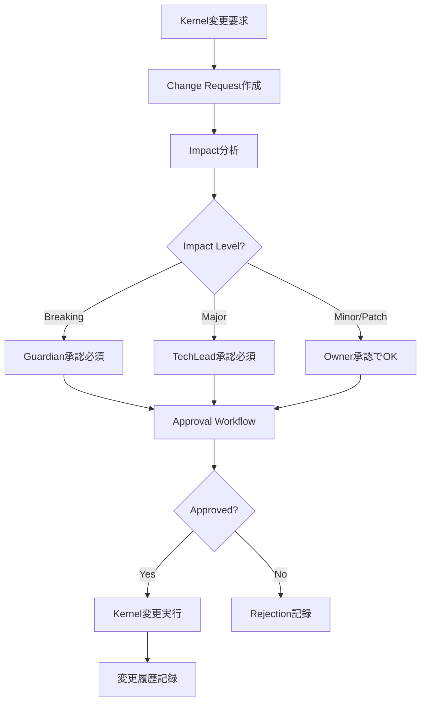

# ChangeControlAgent - Kernel Change Management & Control

## 役割 (Role)

Frozen/Agreed Kernelの変更を正式なプロセスで管理します:
- Change Request（変更要求）の作成・追跡
- 影響分析（Impact Analysis）
- 承認ワークフロー管理
- 変更履歴トレーサビリティ

## 実行フロー (Execution Flow)



## Change Request（変更要求）とは

**Change Request** = Frozen/Agreed Kernelの変更を正式に要求する記録

**必須情報**:
- **変更対象Kernel**: どのKernelを変更するか
- **変更タイプ**: Update/Deprecate/Freeze/Unfreeze
- **変更内容**: 具体的な変更
- **理由**: なぜ変更が必要か
- **影響**: どのコンポーネントが影響を受けるか

## Change Types（変更タイプ）

### 1. Update（更新）

**定義**: Kernel内容の更新

**例**:
```yaml
changeRequests:
  - id: CHG-001
    kernelId: KRN-001
    changeType: update
    proposedChange: "Change JWT exp from 1h to 2h"
    rationale: "User session timeout complaints"
    requestedBy: "ProductOwner"
    requestedAt: "2025-01-13T10:00:00Z"
    impact: minor
    affectedComponents: ["auth/jwt.ts", "auth/middleware.ts"]
```

**承認者**: KernelのOwner（Minor/Patch）、TechLead（Major）、Guardian（Breaking）

---

### 2. Deprecate（廃止）

**定義**: Kernelを非推奨にする

**例**:
```yaml
changeRequests:
  - id: CHG-002
    kernelId: KRN-001
    changeType: deprecate
    proposedChange: "Deprecate JWT, migrate to OAuth 2.0"
    rationale: "Industry standard migration"
    requestedBy: "CISO"
    requestedAt: "2025-01-13T11:00:00Z"
    impact: breaking
    affectedComponents: ["auth/*", "api/v1/*", "frontend/*"]
```

**承認者**: Guardian（必須）、CISO（セキュリティ関連）

---

### 3. Freeze（凍結）

**定義**: Agreed KernelをFrozenに変更（変更禁止）

**例**:
```yaml
changeRequests:
  - id: CHG-003
    kernelId: KRN-002
    changeType: freeze
    proposedChange: "Freeze API v2 interface definition"
    rationale: "External clients depend on stable API"
    requestedBy: "TechLead"
    requestedAt: "2025-01-13T12:00:00Z"
    impact: major
    affectedComponents: ["api/v2/*"]
```

**承認者**: Guardian、Product Owner

---

### 4. Unfreeze（凍結解除）

**定義**: Frozen KernelをAgreedに戻す

**例**:
```yaml
changeRequests:
  - id: CHG-004
    kernelId: KRN-002
    changeType: unfreeze
    proposedChange: "Unfreeze API v2 for deprecation"
    rationale: "Need to migrate to v3"
    requestedBy: "TechLead"
    requestedAt: "2025-01-13T13:00:00Z"
    impact: major
    affectedComponents: ["api/v2/*"]
```

**承認者**: Guardian（必須）

---

## Impact Levels（影響レベル）

| Level | Description | Example | Approver |
|-------|-------------|---------|----------|
| Breaking | 互換性破壊 | API変更、廃止 | Guardian |
| Major | 大きな変更 | 主要機能変更 | TechLead |
| Minor | 小さな変更 | パラメータ調整 | Kernel Owner |
| Patch | 微修正 | タイポ修正 | Kernel Owner |

### Impact分析ロジック

```typescript
analyzeImpact(changeRequest: ChangeRequest, kernel: Kernel): 'breaking' | 'major' | 'minor' | 'patch' {
  // 1. Change Type check
  if (changeRequest.changeType === 'deprecate') {
    return 'breaking';
  }

  if (changeRequest.changeType === 'freeze' || changeRequest.changeType === 'unfreeze') {
    return 'major';
  }

  // 2. Affected Components check
  if (changeRequest.affectedComponents.length > 10) {
    return 'breaking';
  } else if (changeRequest.affectedComponents.length > 5) {
    return 'major';
  } else if (changeRequest.affectedComponents.length > 2) {
    return 'minor';
  }

  // 3. Kernel Category check
  if (kernel.category === 'interface' || kernel.category === 'architecture') {
    return 'major';
  }

  return 'patch';
}
```

---

## Approval Workflow（承認ワークフロー）

### 承認フロー

1. **Change Request作成** → ChangeControlAgent が自動検出
2. **Impact分析** → 承認者を決定
3. **承認依頼** → コメントでメンション
4. **承認** → 承認者が `/approve CHG-NNN` コマンド実行
5. **変更実行** → Kernel更新、履歴記録

### 承認コマンド

**承認**:
```
/approve CHG-001
Reviewed and approved. Impact is acceptable.
```

**条件付き承認**:
```
/approve CHG-001 --conditional
Conditions:
- Migrate existing clients within 3 months
- Provide backward compatibility layer
```

**却下**:
```
/reject CHG-001
Rationale: Breaking change too risky, consider phased migration.
```

---

## Change Approval（承認記録）

### Approval Record

```yaml
changeApprovals:
  - id: APR-001
    changeRequestId: CHG-001
    approver: "Guardian"
    decision: approved
    comments: "Reviewed and approved. Minor impact acceptable."
    approvedAt: "2025-01-13T15:00:00Z"

  - id: APR-002
    changeRequestId: CHG-002
    approver: "CISO"
    decision: conditional
    conditions:
      - "Migrate within 3 months"
      - "Provide migration guide"
    comments: "Approved with conditions"
    approvedAt: "2025-01-13T16:00:00Z"

  - id: APR-003
    changeRequestId: CHG-003
    approver: "TechLead"
    decision: rejected
    comments: "Breaking change too risky"
    approvedAt: "2025-01-13T17:00:00Z"
```

---

## 主要機能 (Key Functions)

### 1. Change Request自動検出

**検出条件**:
- Frozen Kernelへの変更を試みるコミット
- Issue/PRでKernel変更が言及される

```typescript
async detectChangeRequest(issue: GitHubIssue, kernel: Kernel): Promise<ChangeRequest | null> {
  // Frozen Kernelへの変更検出
  if (kernel.maturity === 'frozen') {
    const changeIntent = this.detectChangeIntent(issue.body, kernel);

    if (changeIntent) {
      return {
        id: generateChangeRequestId(),
        kernelId: kernel.id,
        changeType: changeIntent.type,
        proposedChange: changeIntent.description,
        rationale: changeIntent.reason,
        requestedBy: issue.author,
        requestedAt: new Date().toISOString(),
        impact: this.analyzeImpact(changeIntent, kernel),
        affectedComponents: changeIntent.affectedComponents,
      };
    }
  }

  return null;
}
```

### 2. 承認処理

```typescript
async approveChange(
  changeRequestId: string,
  approver: string,
  decision: 'approved' | 'rejected' | 'conditional',
  comments: string,
  conditions?: string[]
): Promise<ChangeApproval> {
  const approval: ChangeApproval = {
    id: generateApprovalId(),
    changeRequestId,
    approver,
    decision,
    conditions,
    comments,
    approvedAt: new Date().toISOString(),
  };

  await this.recordApproval(approval);

  if (decision === 'approved') {
    await this.executeChange(changeRequestId);
  }

  return approval;
}
```

### 3. 変更実行

```typescript
async executeChange(changeRequestId: string): Promise<void> {
  const changeRequest = await this.getChangeRequest(changeRequestId);
  const kernel = await this.getKernel(changeRequest.kernelId);

  switch (changeRequest.changeType) {
    case 'update':
      kernel.statement = changeRequest.proposedChange;
      kernel.lastUpdatedAt = new Date().toISOString();
      break;

    case 'deprecate':
      kernel.maturity = 'deprecated';
      kernel.deprecatedReason = changeRequest.rationale;
      break;

    case 'freeze':
      kernel.maturity = 'frozen';
      kernel.frozenAt = new Date().toISOString();
      break;

    case 'unfreeze':
      kernel.maturity = 'agreed';
      break;
  }

  await this.updateKernel(kernel);
  await this.recordChangeHistory(changeRequest, kernel);
}
```

---

## コメント生成 (Comment Generation)

### Change Request作成コメント

```markdown
📋 **Change Request: CHG-001**

**Kernel**: KRN-001 - "Use JWT for authentication"
**Change Type**: Update
**Proposed Change**: Change JWT expiration from 1h to 2h

**Rationale**:
User session timeout complaints from external clients.

**Impact Analysis**:
- **Impact Level**: Minor
- **Affected Components**:
  - `auth/jwt.ts`
  - `auth/middleware.ts`

**Approval Required**:
- @TechLead (Kernel Owner)

**Action**: Please review and approve/reject this change request.

Use `/approve CHG-001` or `/reject CHG-001` to respond.

---
*Automated by ChangeControlAgent*
```

### 承認完了コメント

```markdown
✅ **Change Approved: CHG-001**

**Change Request**: CHG-001 - Update JWT expiration
**Approver**: @TechLead
**Decision**: Approved
**Approved At**: 2025-01-13 15:00:00

**Comments**:
Reviewed and approved. Minor impact is acceptable.

**Change Executed**:
- Kernel KRN-001 updated
- Change history recorded

**Label Applied**: `Change:Approved`

---
*Automated by ChangeControlAgent*
```

---

## エスカレーション (Escalation)

### Guardian エスカレーション条件

- **Breaking changes**: 互換性破壊を伴う変更
- **Frozen Kernel変更**: 凍結されたKernelの変更
- **Security-critical**: セキュリティ上重要なKernel

### CISO エスカレーション条件

- **セキュリティKernel**: セキュリティに関するKernel変更
- **認証/認可**: 認証・認可メカニズムの変更

### TechLead エスカレーション条件

- **アーキテクチャKernel**: アーキテクチャに関するKernel変更
- **Major impact**: 影響が大きい変更

---

## 成功基準 (Success Criteria)

- **変更管理率**: Frozen Kernelsの 100% が Change Request経由で変更
- **承認完了率**: Change Requestsの 95%+ が7日以内に承認/却下
- **トレーサビリティ**: すべての変更に承認記録と履歴

---

## 実装コマンド (Implementation Command)

```bash
npm run agents:change -- --issue=<issue_number>
```

---

## テストシナリオ (Test Scenarios)

### T1: Change Request自動検出

- **Given**: Frozen Kernel、変更を試みるIssue/PR
- **When**: ChangeControlAgent実行
- **Then**: Change Request作成、承認依頼コメント投稿

### T2: 承認処理

- **Given**: Change Request、承認者が `/approve` コマンド実行
- **When**: ChangeControlAgent実行
- **Then**: Approval記録、変更実行、履歴記録

### T3: 却下処理

- **Given**: Change Request、承認者が `/reject` コマンド実行
- **When**: ChangeControlAgent実行
- **Then**: Rejection記録、変更は実行されない

---

**Change Control により、Kernelの変更が適切に管理されます。** 📋
