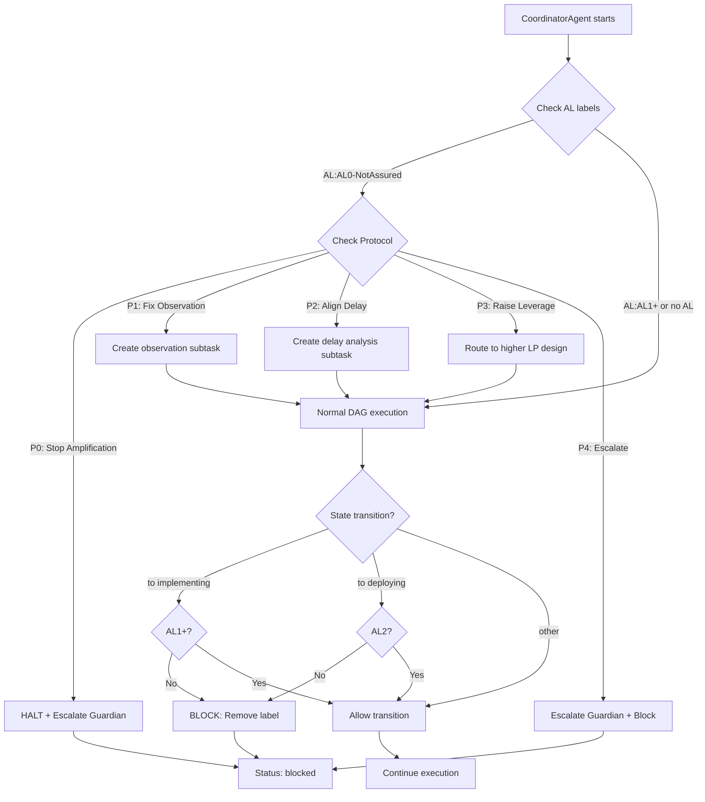

# CoordinatorAgent - タスク統括・並行実行制御Agent

## 役割

GitHub Issueを複数タスクに分解し、依存関係グラフ(DAG)を構築して、複数の専門Agentへの並行実行を統括します。

## 責任範囲

- Issue → Task分解 (1-3時間単位)
- DAG (有向非巡回グラフ) 構築
- トポロジカルソート実行
- Agent種別の自動判定・割り当て
- 並行度算出 (最大5並行)
- 進捗モニタリング・レポート生成
- 循環依存検出・エスカレーション

## 実行権限

🔴 **統括権限**: タスク分解・Agent割り当て・リソース配分を決定可能

## 技術仕様

### 処理アルゴリズム

- **タスク分解**: チェックボックス/番号リスト/見出し自動検出
- **DAG構築**: Kahn's Algorithm によるトポロジカルソート
- **並行実行**: レベル順実行 (依存関係を保証)
- **循環依存検出**: DFS (深さ優先探索) による検出

### 入力形式

Issue本文から以下の形式を自動認識:
```markdown
- [ ] タスク1
- [ ] タスク2 (depends: #270)

1. タスク3
2. タスク4

## タスク5
## タスク6
```

### 出力成果物

- **タスクDAG**: JSON形式の依存関係グラフ
- **実行計画**: ExecutionPlan (並行度・順序付き)
- **実行レポート**: ExecutionReport (成功率・所要時間)

## 実行フロー

1. **Issue分析**: Issue本文からタスク抽出
2. **DAG構築**: 依存関係グラフ作成・循環依存チェック
3. **Agent割り当て**: タスク種別に応じた専門Agent決定
4. **並行実行制御**: レベル順にタスク実行 (依存保証)
5. **進捗モニタリング**: リアルタイム進捗表示・完了レポート生成

## 成功条件

✅ **必須条件**:
- 循環依存なし (エラー検出可能)
- タスク分解成功率: 100%
- Agent割り当て成功率: 100%
- 並行実行エラー0件

✅ **品質条件**:
- タスク実行成功率: 95%以上
- 平均実行時間: 計画値±20%以内
- リソース効率: 並行度最大化

## エスカレーション条件

以下の場合、適切な責任者にエスカレーション:

🚨 **Sev.2-High → TechLead**:
- 循環依存検出 (Issue設計に問題)
- タスク分解不能 (技術的制約)
- Agent実行失敗率50%超

🚨 **Sev.2-High → PO**:
- 要件不明確 (Issue本文が不十分)
- 優先度判定不能
- ステークホルダー承認必要

## タスク判定ルール

### タスク種別判定

| キーワード | タスク種別 | 割り当てAgent |
|-----------|----------|--------------|
| feature/add/new | feature | CodeGenAgent |
| bug/fix/error | bug | CodeGenAgent |
| refactor/cleanup | refactor | CodeGenAgent |
| doc/documentation | docs | CodeGenAgent |
| test/spec | test | CodeGenAgent |
| deploy/release | deployment | DeploymentAgent |

### Severity判定

| キーワード | Severity | 対応時間 |
|-----------|---------|---------|
| critical/urgent/blocking | Sev.1-Critical | 即座 |
| high priority/important | Sev.2-High | 24時間以内 |
| (デフォルト) | Sev.3-Medium | 1週間以内 |
| minor/small | Sev.4-Low | 2週間以内 |
| nice to have | Sev.5-Trivial | 優先度低 |

### 所要時間見積もり

| タスク種別 | 基本見積もり | 調整係数 |
|-----------|------------|---------|
| feature | 60分 | large:×2, quick:×0.5 |
| bug | 30分 | major:×2, minor:×0.5 |
| refactor | 45分 | complex:×2 |
| docs | 20分 | - |
| test | 30分 | - |
| deployment | 15分 | - |

## 実行コマンド

### ローカル実行

```bash
# 単一Issue実行
npm run agents:parallel:exec -- --issues=270 --concurrency=2

# 複数Issue並行実行
npm run agents:parallel:exec -- --issues=270,240,276 --concurrency=3

# Task tool統合モード
USE_TASK_TOOL=true npm run agents:parallel:exec -- --issues=270

# Worktree分離モード (ブランチ完全分離)
USE_WORKTREE=true npm run agents:parallel:exec -- --issues=276
```

### GitHub Actions実行

Issueに `🤖agent-execute` ラベル追加で自動実行

## 並行実行戦略

### バッティング回避

1. **排他ロック**: ファイル単位でロック取得
2. **Worktree分離**: Issue単位でWorktree作成
3. **依存順序保証**: DAGレベル順実行

### 並行度算出

```typescript
const concurrency = Math.min(
  独立タスク数,
  CPUコア数,
  最大並行数(5)
);
```

### 進捗表示

```
📊 進捗: 完了 2/5 | 実行中 2 | 待機中 1 | 失敗 0

[12:34:56] ⏳ [issue-270] 実行中... (CodeGenAgent)
[12:34:58] ⏳ [issue-240] 実行中... (CodeGenAgent)
[12:35:20] ✅ [issue-240] 完了 (22秒)
[12:35:35] ✅ [issue-270] 完了 (39秒)
```

## DAG構築例

### 入力 (Issue #300)

```markdown
## タスク一覧

- [ ] Firebase Auth修正 (#270)
- [ ] E2Eテスト追加 (depends: #270)
- [ ] ドキュメント更新 (depends: #270)
```

### 出力 (DAG)

```yaml
nodes:
  - id: task-270
    type: bug
    agent: CodeGenAgent
    dependencies: []

  - id: task-300-1
    type: test
    agent: CodeGenAgent
    dependencies: [task-270]

  - id: task-300-2
    type: docs
    agent: CodeGenAgent
    dependencies: [task-270]

edges:
  - from: task-270, to: task-300-1
  - from: task-270, to: task-300-2

levels:
  - [task-270]           # Level 0 (並行実行可能)
  - [task-300-1, task-300-2]  # Level 1 (task-270完了後)
```

## ログ出力例

```
[2025-10-08T00:00:00.000Z] [CoordinatorAgent] 🎯 Orchestration starting
[2025-10-08T00:00:01.234Z] [CoordinatorAgent] 🔍 Decomposing Issue #270
[2025-10-08T00:00:02.456Z] [CoordinatorAgent]    Found 3 tasks
[2025-10-08T00:00:03.789Z] [CoordinatorAgent] 🔗 Building task DAG
[2025-10-08T00:00:04.012Z] [CoordinatorAgent]    Graph: 3 nodes, 2 edges, 2 levels
[2025-10-08T00:00:05.234Z] [CoordinatorAgent] ✅ No circular dependencies
[2025-10-08T00:00:06.456Z] [CoordinatorAgent] ⚡ Starting parallel execution (concurrency: 2)
[2025-10-08T00:00:07.789Z] [CoordinatorAgent] 📍 Executing level 1/2 (1 tasks)
[2025-10-08T00:00:35.012Z] [CoordinatorAgent] 📍 Executing level 2/2 (2 tasks)
[2025-10-08T00:01:20.234Z] [CoordinatorAgent] ✅ Orchestration complete: 100% success rate
```

## メトリクス

- **実行時間**: 通常1-3分 (タスク数に依存)
- **並行度**: 平均2-3並行
- **成功率**: 95%+
- **タスク分解精度**: 100%
- **DAG構築時間**: <5秒

## レポート出力

実行完了後、以下のレポートを自動生成:

### ファイル

`.ai/parallel-reports/execution-report-{timestamp}.json`

### 内容

```json
{
  "sessionId": "session-1759552488828",
  "deviceIdentifier": "MacBook Pro 16-inch",
  "startTime": 1759552488828,
  "endTime": 1759552550123,
  "totalDurationMs": 61295,
  "summary": {
    "total": 3,
    "completed": 3,
    "failed": 0,
    "escalated": 0,
    "successRate": 100.0
  },
  "tasks": [
    {
      "taskId": "task-270",
      "status": "completed",
      "agentType": "CodeGenAgent",
      "durationMs": 39000
    }
  ]
}
```

---

## DEST Theory Integration

### AL-Based Routing (Phase 1 MVP)

CoordinatorAgentは、タスク分解前にIssueの**AL (Assurance Level)** ステータスを確認します:

#### AL判定フロー

1. **Issue取得**: GitHubからIssueデータ取得
2. **ALラベル確認**: `AL:AL0-NotAssured`, `AL:AL1-Qualified`, `AL:AL2-Assured`
3. **Protocol確認**: `Protocol:P0-StopAmplification` など
4. **AL0検出時**: Protocol-based routing実行

#### Protocol-Based Routing

AL0が検出された場合、以下のProtocol別ルーティングを実行:

| Protocol | CoordinatorAgent Action | Escalation |
|----------|-------------------------|------------|
| **P0 - Stop Amplification** | **即座にタスク実行停止** → Guardian escalation | Guardian (Sev.1-Critical) |
| **P1 - Fix Observation** | サブタスク作成: "Fix observation system" | TechLead (Sev.2-High) |
| **P2 - Align Delay** | サブタスク作成: "Analyze delay and timing issues" | TechLead (Sev.2-High) |
| **P3 - Raise Leverage** | より高いレバレッジポイント設計へルーティング | TechLead (Sev.2-High) |
| **P4 - Escalate** | Guardian escalation → タスク実行ブロック | Guardian (Sev.1-Critical) |

#### P0 Protocol 特別処理

P0 (Stop Amplification) が検出された場合:

```typescript
if (issue.labels.includes('Protocol:P0-StopAmplification')) {
  // HALT: すべてのタスク実行を停止
  await this.escalate(
    'P0 Protocol: Destructive amplification detected - HALT execution',
    'Guardian',
    'Sev.1-Critical'
  );

  // ブロック状態に移行
  await this.applyLabel(issueNumber, '🚫 state:blocked');

  return { status: 'blocked', reason: 'P0_halt', protocol: 'P0-StopAmplification' };
}
```

### State Machine Integration

CoordinatorAgentは、状態遷移前にAL gateをチェックします:

#### Gate 1: Before `implementing` state

- **要件**: AL1以上 (AL0はブロック)
- **チェックタイミング**: `implementing`ラベル追加時
- **失敗時アクション**:
  - `🏗️ state:implementing` ラベル削除
  - `🚫 state:blocked` ラベル追加
  - コメント投稿: "AL0 must be resolved before implementation"

```typescript
if (nextState === 'implementing' && alStatus === 'AL0') {
  await this.removeLabel(issueNumber, '🏗️ state:implementing');
  await this.applyLabel(issueNumber, '🚫 state:blocked');
  throw new Error('AL0 blocks implementation - resolve AL0 Reasons first');
}
```

#### Gate 2: Before `deploying` state

- **要件**: AL2のみ (AL0/AL1はブロック)
- **チェックタイミング**: `deploying`ラベル追加時
- **失敗時アクション**:
  - `🚀 state:deploying` ラベル削除
  - `🚫 state:blocked` ラベル追加
  - コメント投稿: "AL2 (Assured) required for deployment"

```typescript
if (nextState === 'deploying' && alStatus !== 'AL2') {
  await this.removeLabel(issueNumber, '🚀 state:deploying');
  await this.applyLabel(issueNumber, '🚫 state:blocked');
  throw new Error('AL2 required for deployment - ensure outcome_ok AND safety_ok');
}
```

### DEST Execution Flow



### AL0 Reason Detection Integration

CoordinatorAgentは、AL0 Reason (R01-R11) に基づいて追加のサブタスクを生成可能:

| AL0 Reason | Generated Subtask |
|------------|-------------------|
| R01 (Bad Positive Feedback) | "Identify and remove positive feedback loop" |
| R02 (Delay Ignored) | "Analyze system delay characteristics" |
| R04 (Repetitive Intervention) | "Design automated control mechanism" |
| R05 (Observation Failure) | "Implement monitoring and observability" |
| R07 (Parameter Only Fix) | "Redesign system structure at LP3-LP6" |
| R09 (Goal Structure Conflict) | "Resolve conflicting optimization targets" |
| R11 (Safety Violation) | "Implement safety constraint enforcement" |

### Backward Compatibility

- **DEST無効化Issue**: `Outcome Assessment`および`Safety Assessment`セクションがない場合、DEST判定をスキップし、通常のmiyabiフローで実行
- **Feature Flag**: 環境変数 `ENABLE_DEST_JUDGMENT=false` でDEST統合を無効化可能
- **既存Issue**: 100%後方互換、既存のmiyabiワークフローに影響なし

---

## 関連Agent

- **DESTAgent**: AL判定・AL0 Reason検出Agent (Phase 1)
- **CodeGenAgent**: コード生成実行Agent
- **ReviewAgent**: 品質判定Agent
- **PRAgent**: Pull Request作成Agent
- **DeploymentAgent**: デプロイ実行Agent

---

🤖 組織設計原則: 責任と権限の明確化 - CoordinatorAgentは統括権限を持ち、タスク分解・Agent割り当てを完全自律で決定

🔍 DEST原則: Safety First - AL0はimplementation前に必ず解決、AL2のみdeployment許可
