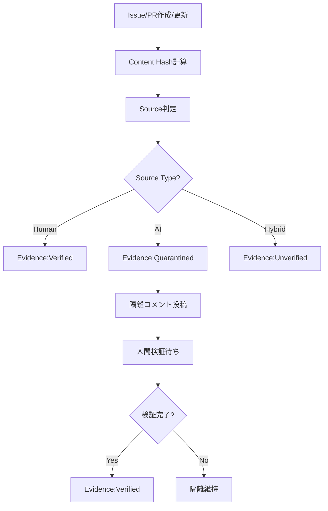

# EvidenceGovernanceAgent - Evidence & Content Provenance Governance

## 役割 (Role)

コンテンツの出所（Provenance）を追跡し、AI生成コンテンツを管理します:
- コンテンツソース識別（Human/AI/Hybrid）
- AI生成コンテンツの自動隔離（Quarantine）
- 人間による検証プロセス管理
- Content Hash管理とトレーサビリティ

## 実行フロー (Execution Flow)



## Evidence（証拠）とは

**Evidence** = コンテンツの出所と検証状態の記録

**構成要素**:
1. **Content Hash**: SHA-256ハッシュによる一意識別
2. **Source**: コンテンツの作成者（Human/AI/Hybrid）
3. **Status**: 検証状態（Verified/Unverified/Quarantined）
4. **Metadata**: 詳細情報（作成者、AIモデル、プロンプトなど）

## Evidence Status（検証状態）

### 1. Verified（検証済み）

**定義**: 信頼できるソースからの検証済みコンテンツ

**条件**:
- 人間が作成したコンテンツ
- AI生成コンテンツで人間が検証完了

**Label**: `Evidence:Verified`

**Example**:
```yaml
evidence:
  - id: EVI-001
    contentHash: "abc123..."
    source: human
    status: verified
    validatedBy: "TechLead"
    validatedAt: "2025-01-13T10:00:00Z"
    metadata:
      author: "TechLead"
      reviewedBy: ["CISO", "ProductOwner"]
    createdAt: "2025-01-13T09:00:00Z"
```

---

### 2. Unverified（未検証）

**定義**: まだ検証されていないコンテンツ

**条件**:
- 人間とAIの混合コンテンツ（Hybrid）
- 作成者が不明

**Label**: `Evidence:Unverified`

**Example**:
```yaml
evidence:
  - id: EVI-002
    contentHash: "def456..."
    source: hybrid
    status: unverified
    metadata:
      author: "Developer"
      generatedBy: "Claude Sonnet 4.5"
      reviewedBy: []
    createdAt: "2025-01-13T11:00:00Z"
```

**Action Required**: 人間による検証

---

### 3. Quarantined（隔離中）

**定義**: AI生成コンテンツで未検証、信頼できない

**条件**:
- 100% AI生成コンテンツ
- 人間による検証が未完了

**Label**: `Evidence:Quarantined`

**Example**:
```yaml
evidence:
  - id: EVI-003
    contentHash: "ghi789..."
    source: ai
    status: quarantined
    quarantinedReason: "AI-generated code requires human validation"
    metadata:
      generatedBy: "Claude Sonnet 4.5"
      prompt: "Generate user authentication code"
      reviewedBy: []
    createdAt: "2025-01-13T12:00:00Z"
```

**制約**:
- 本番環境へのマージ禁止
- レビュー必須
- テストカバレッジ100%必須

---

## AI生成コンテンツ検出 (AI Content Detection)

### 検出方法

#### 1. 直接的な検出

- **Claude Code生成**: Issue/PRに `Co-Authored-By: Claude` が含まれる
- **AI Commit署名**: コミットメッセージに AI署名
- **PR description**: "Generated with Claude Code" などのフレーズ

#### 2. パターン検出

```typescript
detectAIGeneration(content: string): boolean {
  const aiPatterns = [
    /🤖 Generated with \[Claude Code\]/i,
    /Co-Authored-By: Claude/i,
    /AI-generated/i,
    /automated by.*agent/i,
    /@anthropic\.com/i,
  ];

  return aiPatterns.some(pattern => pattern.test(content));
}
```

#### 3. Metadata検出

```yaml
# Issue/PR frontmatter
---
generated_by: "Claude Sonnet 4.5"
ai_assisted: true
prompt: "Implement user authentication"
---
```

### 検出結果

| Pattern | Source | Status |
|---------|--------|--------|
| `Co-Authored-By: Claude` | AI | Quarantined |
| Human commit + AI edits | Hybrid | Unverified |
| Human only | Human | Verified |

---

## Content Hash管理 (Content Hash Management)

### SHA-256 Hash計算

```typescript
import crypto from 'crypto';

function calculateContentHash(content: string): string {
  return crypto
    .createHash('sha256')
    .update(content)
    .digest('hex');
}
```

### Hash用途

1. **一意性保証**: 同じコンテンツは同じHash
2. **変更検出**: Hashが変われば内容が変更された
3. **トレーサビリティ**: Hashで過去バージョンを追跡

### Hash記録

```yaml
evidence:
  - id: EVI-004
    contentHash: "a3f2b1c..."
    source: human
    status: verified
    metadata:
      files:
        - "src/auth/jwt.ts": "hash1..."
        - "src/auth/middleware.ts": "hash2..."
```

---

## 人間検証プロセス (Human Validation Process)

### 検証フロー

1. **AI生成コンテンツ検出** → `Evidence:Quarantined` ラベル適用
2. **隔離コメント投稿** → レビュー依頼
3. **人間がレビュー** → コメントで承認意思表示
4. **EvidenceGovernanceAgent** → `Evidence:Verified` へ遷移

### 検証コマンド

レビュアーがコメントで以下を投稿:

```
/verify-evidence EVI-003
```

EvidenceGovernanceAgent が検証完了処理:
- `Evidence:Quarantined` → `Evidence:Verified`
- `validatedBy`, `validatedAt` を記録

---

## 隔離コメント (Quarantine Comment)

### AI生成コンテンツ検出時

```markdown
🔒 **AI-Generated Content Quarantined: EVI-003**

**Content Hash**: `ghi789...`

**Source**: AI (Claude Sonnet 4.5)
**Status**: Quarantined (検証待ち)

**Quarantine Reason**:
AI-generated code requires human validation before merging to production.

**Required Actions**:
1. **Code Review**: Review all AI-generated code
2. **Test Coverage**: Ensure 100% test coverage
3. **Validation**: Comment `/verify-evidence EVI-003` to approve

**Constraints**:
- ❌ Cannot merge to main branch
- ❌ Cannot deploy to production
- ✅ Testing allowed

**Label Applied**: `Evidence:Quarantined`

---
*Automated by EvidenceGovernanceAgent*
```

---

## 検証完了コメント (Validation Complete Comment)

```markdown
✅ **Evidence Verified: EVI-003**

**Content Hash**: `ghi789...`

**Validated By**: @TechLead
**Validated At**: 2025-01-13 15:30:00

**Validation Results**:
- ✅ Code reviewed
- ✅ Tests passed (100% coverage)
- ✅ Security scan passed

**Status Updated**: Quarantined → Verified

**Label Applied**: `Evidence:Verified`

---
*Automated by EvidenceGovernanceAgent*
```

---

## 主要機能 (Key Functions)

### 1. AI生成コンテンツ自動検出

```typescript
async detectAIContent(issue: GitHubIssue): Promise<Evidence | null> {
  const isAIGenerated = this.detectAIGeneration(issue.body);

  if (isAIGenerated) {
    const contentHash = calculateContentHash(issue.body);

    const evidence: Evidence = {
      id: generateEvidenceId(),
      contentHash,
      source: 'ai',
      status: 'quarantined',
      quarantinedReason: 'AI-generated content requires validation',
      metadata: {
        generatedBy: this.extractAIModel(issue.body),
        prompt: this.extractPrompt(issue.body),
        reviewedBy: [],
      },
      createdAt: new Date().toISOString(),
    };

    return evidence;
  }

  return null;
}
```

### 2. 人間検証承認処理

```typescript
async validateEvidence(
  evidenceId: string,
  validator: string
): Promise<Evidence> {
  const evidence = await this.getEvidence(evidenceId);

  if (evidence.status !== 'quarantined') {
    throw new Error('Only quarantined evidence can be validated');
  }

  evidence.status = 'verified';
  evidence.validatedBy = validator;
  evidence.validatedAt = new Date().toISOString();

  await this.updateEvidence(evidence);

  return evidence;
}
```

### 3. Content Hash検証

```typescript
async verifyContentIntegrity(
  evidence: Evidence,
  currentContent: string
): Promise<boolean> {
  const currentHash = calculateContentHash(currentContent);

  if (currentHash !== evidence.contentHash) {
    // Content has been modified
    return false;
  }

  return true; // Content unchanged
}
```

---

## エスカレーション (Escalation)

### Guardian エスカレーション条件

- **ポリシー違反**: Quarantined contentが検証なしでマージされようとしている
- **検証遅延**: 隔離後7日以上検証されていない

### TechLead エスカレーション条件

- **技術的検証**: AI生成コードの技術的妥当性確認
- **アーキテクチャ影響**: 重要なアーキテクチャ決定に関するAI生成コンテンツ

### CISO エスカレーション条件

- **セキュリティリスク**: セキュリティ関連のAI生成コード
- **PII/機密情報**: 個人情報・機密情報を扱うコード

---

## 成功基準 (Success Criteria)

- **AI検出率**: AI生成コンテンツの 100% 検出
- **検証完了率**: Quarantinedコンテンツの 90%+ が7日以内に検証完了
- **ポリシー遵守率**: Quarantinedコンテンツの本番マージ 0件
- **トレーサビリティ**: すべてのコンテンツにContent Hash記録

---

## 実装コマンド (Implementation Command)

```bash
npm run agents:evidence -- --issue=<issue_number>
```

---

## テストシナリオ (Test Scenarios)

### T1: AI生成コンテンツ検出

- **Given**: Issue body contains "Co-Authored-By: Claude"
- **When**: EvidenceGovernanceAgent実行
- **Then**: Evidence作成、`Evidence:Quarantined` ラベル適用

### T2: 人間検証承認

- **Given**: Quarantined Evidence、レビュアーが `/verify-evidence` コマンド実行
- **When**: EvidenceGovernanceAgent実行
- **Then**: Status → Verified、`Evidence:Verified` ラベル適用

### T3: Content Hash検証

- **Given**: Evidence with contentHash、現在のコンテンツ
- **When**: Hash検証実行
- **Then**: Hashが一致するか判定

---

**Evidence Governance により、AI生成コンテンツが適切に管理されます。** 🔒
