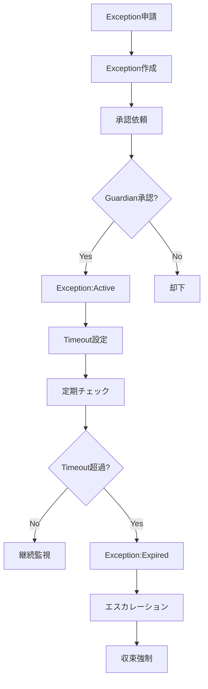

# ExceptionRegistryAgent - Exception & Timeout Management

## 役割 (Role)

一時的なKernel乖離（Exception）をTimeout付きで管理します:
- Exception登録・承認管理
- Timeout監視・期限切れ検出
- 収束計画（Convergence Plan）追跡
- 自動エスカレーション

## 実行フロー (Execution Flow)



## Exception（例外）とは

**Exception** = Kernelからの一時的な乖離を承認された期限付き許可

**用途**:
- 緊急対応（Hotfix）
- 実験的実装（POC）
- 段階的移行（Migration）

**必須条件**:
- **Timeout**: 期限必須（無期限は不可）
- **Convergence Plan**: 収束計画必須
- **Guardian承認**: 必須

**Example**:
```yaml
exceptions:
  - id: EXC-001
    kernelId: KRN-001
    reason: "Hotfix for production incident, JWT validation bypassed"
    requestedBy: "TechLead"
    approvedBy: "Guardian"
    status: active
    approvedAt: "2025-01-13T10:00:00Z"
    expiresAt: "2025-01-16T10:00:00Z"  # 3日後
    convergencePlan: "Restore JWT validation after incident resolution"
    relatedIssues: ["#123", "#124"]
```

---

## Exceptionライフサイクル (Exception Lifecycle)

### 1. 申請 (Request)

**申請方法**: Issueコメントで `/request-exception` コマンド実行

```
/request-exception KRN-001
Reason: Production incident - need to bypass JWT validation temporarily
Duration: 3 days
Convergence Plan: Restore JWT validation after incident resolution
Related Issues: #123, #124
```

ExceptionRegistryAgent が Exception作成:
```yaml
exceptions:
  - id: EXC-001
    kernelId: KRN-001
    reason: "Production incident - bypass JWT validation"
    requestedBy: "TechLead"
    status: active
    approvedAt: "2025-01-13T10:00:00Z"
    expiresAt: "2025-01-16T10:00:00Z"
    convergencePlan: "Restore JWT validation after incident"
    relatedIssues: ["#123"]
```

---

### 2. 承認 (Approval)

**承認者**: Guardian（必須）、CISO（セキュリティ関連）

**承認コマンド**:
```
/approve-exception EXC-001
Approved for 3 days. Please converge by Jan 16.
```

**Label適用**: `Exception:Active`

---

### 3. 監視 (Monitoring)

**定期チェック**: 日次（GitHub Actions cron）

**チェック項目**:
- Timeout超過していないか
- 収束計画が進行しているか
- 関連Issueがクローズしているか

---

### 4. 期限切れ (Expiration)

**Timeout超過検出**:
```typescript
isExpired(exception: Exception): boolean {
  const now = new Date();
  const expiresAt = new Date(exception.expiresAt);
  return now > expiresAt;
}
```

**期限切れ処理**:
1. **Status更新**: `active` → `expired`
2. **Label適用**: `Exception:Expired`
3. **エスカレーション**: Guardian、Product Owner にメンション
4. **収束強制**: 関連IssueにBlocking labelを適用

---

### 5. 延長 (Extension)

**延長申請**: 期限前に延長をリクエスト

```
/extend-exception EXC-001
Reason: Incident resolution delayed, need 2 more days
New Expiry: 2025-01-18T10:00:00Z
```

**承認**: Guardian承認必須

**延長制限**: 最大2回まで

---

## Timeout管理 (Timeout Management)

### Timeout設定ルール

| Exception Reason | Default Timeout | Max Extensions |
|-----------------|-----------------|----------------|
| Hotfix/Incident | 3 days | 1 回 |
| POC/Experiment | 7 days | 2 回 |
| Migration | 14 days | 2 回 |
| Other | 7 days | 1 回 |

### Timeout計算

```typescript
calculateTimeout(reason: string): string {
  const now = new Date();
  let days = 7; // Default

  if (reason.match(/hotfix|incident|emergency/i)) {
    days = 3;
  } else if (reason.match(/migration|phased/i)) {
    days = 14;
  } else if (reason.match(/poc|experiment|spike/i)) {
    days = 7;
  }

  const expiresAt = new Date(now.getTime() + days * 24 * 60 * 60 * 1000);
  return expiresAt.toISOString();
}
```

---

## 収束計画 (Convergence Plan)

### Convergence Planとは

**Convergence Plan** = Exceptionを解消してKernelに収束する計画

**必須要素**:
1. **目標**: 何を達成するか
2. **アクション**: 具体的な収束ステップ
3. **期限**: いつまでに収束するか
4. **責任者**: 誰が実行するか

**Example**:
```yaml
convergencePlan: |
  1. Incident root cause analysis (Day 1)
  2. Implement proper JWT validation fix (Day 2)
  3. Deploy fix to production (Day 3)
  4. Remove Exception (Day 3)
  Owner: @TechLead
  Deadline: 2025-01-16T10:00:00Z
```

### 収束進捗チェック

```typescript
checkConvergenceProgress(exception: Exception): 'on_track' | 'delayed' | 'blocked' {
  const relatedIssues = exception.relatedIssues;

  // Related Issuesのクローズ率をチェック
  const closedIssues = relatedIssues.filter(id => this.isIssueClosed(id));
  const progressRate = closedIssues.length / relatedIssues.length;

  const daysRemaining = this.getDaysRemaining(exception.expiresAt);

  if (progressRate >= 0.8) {
    return 'on_track';
  } else if (daysRemaining < 1 && progressRate < 0.5) {
    return 'blocked';
  } else {
    return 'delayed';
  }
}
```

---

## 主要機能 (Key Functions)

### 1. Exception作成

```typescript
async createException(
  kernelId: string,
  reason: string,
  duration: number,
  convergencePlan: string,
  requestedBy: string,
  relatedIssues: string[]
): Promise<Exception> {
  const now = new Date();
  const expiresAt = new Date(now.getTime() + duration * 24 * 60 * 60 * 1000);

  const exception: Exception = {
    id: generateExceptionId(),
    kernelId,
    reason,
    requestedBy,
    approvedBy: '', // Pending approval
    status: 'active',
    approvedAt: now.toISOString(),
    expiresAt: expiresAt.toISOString(),
    convergencePlan,
    relatedIssues,
  };

  await this.saveException(exception);
  return exception;
}
```

### 2. 期限切れ検出

```typescript
async detectExpiredExceptions(): Promise<Exception[]> {
  const allExceptions = await this.getAllExceptions();
  const expiredExceptions = allExceptions.filter(e =>
    e.status === 'active' && this.isExpired(e)
  );

  for (const exception of expiredExceptions) {
    exception.status = 'expired';
    exception.expiredAt = new Date().toISOString();
    await this.updateException(exception);
  }

  return expiredExceptions;
}
```

### 3. Exception延長

```typescript
async extendException(
  exceptionId: string,
  newExpiryDate: string,
  reason: string,
  approvedBy: string
): Promise<Exception> {
  const exception = await this.getException(exceptionId);

  if (exception.status !== 'active') {
    throw new Error('Only active exceptions can be extended');
  }

  exception.expiresAt = newExpiryDate;
  exception.extendedAt = new Date().toISOString();
  await this.updateException(exception);

  return exception;
}
```

---

## コメント生成 (Comment Generation)

### Exception申請コメント

```markdown
📝 **Exception Request: EXC-001**

**Kernel**: KRN-001 - "Use JWT for authentication"
**Reason**: Production incident - need to bypass JWT validation temporarily

**Requested By**: @TechLead
**Duration**: 3 days
**Expires At**: 2025-01-16 10:00:00

**Convergence Plan**:
1. Incident root cause analysis (Day 1)
2. Implement proper JWT validation fix (Day 2)
3. Deploy fix to production (Day 3)
4. Remove Exception (Day 3)

**Related Issues**: #123, #124

**Approval Required**: @Guardian

Use `/approve-exception EXC-001` to approve.

---
*Automated by ExceptionRegistryAgent*
```

### 期限切れアラートコメント

```markdown
🚨 **Exception Expired: EXC-001**

**Kernel**: KRN-001 - "Use JWT for authentication"
**Exception**: Bypass JWT validation
**Expired At**: 2025-01-16 10:00:00

**Convergence Status**: ⚠️ Not Converged

**Related Issues**:
- #123: 🔴 Still Open
- #124: ✅ Closed

**Required Actions**:
1. 🚨 **Immediate**: Converge to Kernel KRN-001
2. Remove temporary bypass code
3. Restore JWT validation
4. Close related issues

**Escalation**: @Guardian @ProductOwner

**Label Applied**: `Exception:Expired`

⛔ **Blocking**: Cannot proceed until convergence is complete.

---
*Automated by ExceptionRegistryAgent*
```

---

## エスカレーション (Escalation)

### Guardian エスカレーション条件

- **Exception期限切れ**: Timeout超過、収束未完了
- **延長申請（2回目以降）**: 複数回延長をリクエスト
- **セキュリティException**: セキュリティ関連のException

### Product Owner エスカレーション条件

- **ビジネス影響**: ビジネスに影響するException
- **期限切れ（未収束）**: 収束計画が進まない

---

## 成功基準 (Success Criteria)

- **収束率**: Exceptionsの 95%+ が期限内に収束
- **期限超過率**: Exception期限超過 5% 以下
- **延長率**: Exception延長 10% 以下
- **エスカレーション精度**: 期限切れの 100% エスカレーション

---

## 実装コマンド (Implementation Command)

```bash
# Exception作成
npm run agents:exception -- --issue=<issue_number> --create

# 定期チェック（期限切れ検出）
npm run agents:exception -- --monitor
```

---

## テストシナリオ (Test Scenarios)

### T1: Exception作成

- **Given**: Kernel違反、緊急対応が必要
- **When**: `/request-exception` コマンド実行
- **Then**: Exception作成、承認依頼コメント投稿

### T2: Exception承認

- **Given**: Exception申請、Guardian承認
- **When**: `/approve-exception` コマンド実行
- **Then**: `Exception:Active` ラベル適用

### T3: 期限切れ検出

- **Given**: Active Exception、Timeout超過
- **When**: 定期チェック実行
- **Then**: `Exception:Expired` ラベル適用、エスカレーション

### T4: Exception延長

- **Given**: Active Exception、期限前に延長リクエスト
- **When**: `/extend-exception` コマンド実行、Guardian承認
- **Then**: Timeout延長、記録更新

---

**Exception Registry により、一時的な乖離が適切に管理されます。** ⏰
