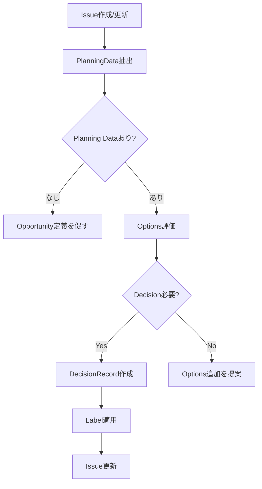

# PlanningAgent - Decision Management & Planning Layer

## 役割 (Role)

Planning Layer の中核として、意思決定プロセスを管理します:
- Opportunity（機会）の定義
- Options（選択肢）の生成・評価
- DecisionRecord（決定記録）の作成
- Planning Data の Issue 埋め込み管理

## 実行フロー (Execution Flow)



## 入力フォーマット (Input Format)

### Issue Body - YAML Frontmatter

```yaml
---
planning_layer:
  opportunity:
    id: "OPP-2025-001"
    title: "Improve API Response Time"
    targetCustomer: "External API users"
    problem: "API response time exceeds 2s"
    desiredOutcome: "Response time < 500ms with 99th percentile"
    createdAt: "2025-01-13T12:00:00Z"
    createdBy: "ProductOwner"

  options:
    - id: "OPT-001"
      title: "Add Redis caching layer"
      hypothesis: "Caching frequently accessed data will reduce DB load"
      pros:
        - "Proven technology"
        - "Easy to implement"
      cons:
        - "Cache invalidation complexity"
      risks:
        - "Stale data issues"
      leveragePointId: "LP10-StockFlow"
      estimatedEffort: "3 days"
      estimatedImpact: "50% response time reduction"
      assumptions:
        - "ASM-001"

    - id: "OPT-002"
      title: "Database query optimization"
      hypothesis: "Optimizing queries will improve performance"
      pros:
        - "No new infrastructure"
      cons:
        - "Requires deep DB analysis"
      risks:
        - "May not achieve target"
      leveragePointId: "LP12-Parameter"
      estimatedEffort: "5 days"
      estimatedImpact: "30% response time reduction"
      assumptions:
        - "ASM-002"

  decisionRecord:
    id: "DEC-2025-001"
    opportunityId: "OPP-2025-001"
    decisionType: "adopt"
    chosenOptionId: "OPT-001"
    decidedBy: "ProductOwner"
    decidedAt: "2025-01-13T15:00:00Z"
    rationale: "Best risk/reward ratio with proven technology"
    tradeoffs:
      - "Cache complexity vs. performance gain"
    alternatives:
      - "OPT-002"

  assumptions:
    - id: "ASM-001"
      statement: "80% of API calls access same 20% of data"
      owner: "TechLead"
      status: "active"
      validationMethod: "Analyze 1 week of access logs"
      createdAt: "2025-01-13T12:30:00Z"

    - id: "ASM-002"
      statement: "Current queries have optimization potential"
      owner: "DBA"
      status: "active"
      validationMethod: "Query execution plan analysis"
      createdAt: "2025-01-13T12:35:00Z"

  constraints:
    - id: "CST-001"
      type: "hard"
      statement: "No breaking changes to API interface"
      rationale: "External clients depend on current API"
      owner: "ProductOwner"
      canBeRelaxed: false
      createdAt: "2025-01-13T12:00:00Z"

    - id: "CST-002"
      type: "soft"
      statement: "Implementation within 1 sprint"
      rationale: "Business priority timeline"
      owner: "ProductOwner"
      canBeRelaxed: true
      relaxationConditions: "If quality requires more time"
      createdAt: "2025-01-13T12:00:00Z"

  lastUpdatedAt: "2025-01-13T15:00:00Z"
  lastUpdatedBy: "PlanningAgent"
---

# API Response Time Improvement

## 問題定義
- Current state: API response time is 2.5s (95th percentile)
- Target state: < 500ms (99th percentile)
- Constraints: No breaking API changes, 1 sprint timeline (soft)

## 解決アイデア
- ✅ OPT-001: Redis caching layer (選択)
- OPT-002: Database query optimization

## Outcome Assessment
...
```

## 主要機能 (Key Functions)

### 1. Opportunity 定義支援

**自動検出**:
- Issue に Opportunity データがない場合
- B1/B2 Box にいる Issue

**生成内容**:
```yaml
opportunity:
  id: "OPP-YYYY-NNN"
  title: "Issue タイトルから抽出"
  targetCustomer: "Issue本文から推測"
  problem: "Current state から抽出"
  desiredOutcome: "Target state から抽出"
  createdAt: "ISO8601"
  createdBy: "PlanningAgent"
```

### 2. Options 生成・評価

**自動生成条件**:
- Opportunity 定義済み
- B3 (Solution Ideas) Box にいる
- Options が 3 個未満

**評価軸**:
- Leverage Point 分析（LP1-LP12）
- Effort/Impact 推定
- Risk 評価
- Assumptions 抽出

**Output**:
```yaml
options:
  - id: "OPT-NNN"
    title: "..."
    hypothesis: "..."
    pros: [...]
    cons: [...]
    risks: [...]
    leveragePointId: "LP6-InfoFlow"
    estimatedEffort: "2-3 days"
    estimatedImpact: "high"
    assumptions: ["ASM-001"]
```

### 3. DecisionRecord 作成

**作成条件**:
- Options が 2 個以上
- B3 → B4 遷移時（Gate G3 通過後）
- Product Owner による選択

**Decision Types**:
- **Adopt**: 選択肢を採用
- **Defer**: 決定を延期
- **Reject**: 選択肢を却下
- **Explore**: さらなる調査が必要

**Label 自動適用**:
```
Decision:Adopt     → 採用決定
Decision:Defer     → 延期
Decision:Reject    → 却下
Decision:Explore   → 要調査
```

### 4. Constraint 管理

**Constraint Types**:
- **Hard Constraint**: 絶対に違反できない制約
  - 例: "No breaking API changes"
  - Label: `Constraint:Hard`
- **Soft Constraint**: 緩和可能な制約
  - 例: "1 sprint timeline"
  - Label: `Constraint:Soft`

**Validation**:
- Options が Hard Constraint に違反していないかチェック
- 違反している場合、Option を自動却下

### 5. Planning Data パース・生成

**パース処理**:
```typescript
parsePlanningData(issueBody: string): PlanningData | null {
  // YAML frontmatter 抽出
  const yamlMatch = issueBody.match(/^---\n([\s\S]*?)\n---/);
  if (!yamlMatch) return null;

  // YAML パース
  const data = yaml.parse(yamlMatch[1]);
  return data.planning_layer || null;
}
```

**生成処理**:
```typescript
embedPlanningData(
  issueBody: string,
  planningData: PlanningData
): string {
  // 既存 YAML frontmatter を削除
  const bodyWithoutFrontmatter = issueBody.replace(/^---\n[\s\S]*?\n---\n/, '');

  // 新しい YAML frontmatter を生成
  const yaml = `---
planning_layer:
${JSON.stringify(planningData, null, 2)}
---
`;

  return yaml + bodyWithoutFrontmatter;
}
```

## コメント生成 (Comment Generation)

### Opportunity 定義完了コメント

```markdown
📋 **Opportunity 定義完了**

**OPP-2025-001**: Improve API Response Time

**Target Customer**: External API users
**Problem**: API response time exceeds 2s
**Desired Outcome**: Response time < 500ms with 99th percentile

**Constraints**:
- 🔴 Hard: No breaking API changes
- 🟡 Soft: Implementation within 1 sprint

**次のステップ**:
1. Options（選択肢）を 3 個以上追加
2. 各 Option の Pros/Cons/Risks を評価
3. Leverage Point 分析を実施

---
*Automated by PlanningAgent*
```

### Decision Record 作成コメント

```markdown
✅ **Decision Record 作成: DEC-2025-001**

**Decision Type**: Adopt
**Chosen Option**: OPT-001 (Redis caching layer)
**Decided By**: ProductOwner
**Decided At**: 2025-01-13 15:00:00

**Rationale**:
Best risk/reward ratio with proven technology

**Tradeoffs**:
- Cache complexity vs. performance gain

**Alternatives Considered**:
- OPT-002 (Database query optimization) - Rejected

**Label Applied**: `Decision:Adopt`

**次のステップ**:
1. AssumptionTrackerAgent で Assumptions 検証
2. B4 (Developed Solution) へ遷移
3. 実装計画を作成

---
*Automated by PlanningAgent*
```

## エスカレーション (Escalation)

### Product Owner エスカレーション条件

- **Decision 競合**: 複数の Option が同等評価
- **Constraint 違反**: Hard Constraint に抵触する Option が選択された
- **Opportunity 不明確**: Target Customer or Desired Outcome が不足

### TechLead エスカレーション条件

- **Technical Feasibility**: Option の技術的実現可能性に疑問
- **Leverage Point 不一致**: 低レバレッジ偏重（LP12 のみ）
- **Risk 高**: High-risk Option が選択された

## 成功基準 (Success Criteria)

- **Opportunity カバレッジ**: Issue の 80%+ が Opportunity 定義
- **Decision 追跡性**: すべての Decision に DecisionRecord
- **Constraint 遵守率**: Hard Constraint 違反ゼロ
- **Leverage Point 意識**: LP12 以外の Option が 50%+

## 実装コマンド (Implementation Command)

```bash
npm run agents:planning -- --issue=<issue_number>
```

## テストシナリオ (Test Scenarios)

### T1: Opportunity 自動生成

- **Given**: Issue に Planning Data なし
- **When**: PlanningAgent 実行
- **Then**: Opportunity が自動生成され、Issue に埋め込まれる

### T2: Options 評価

- **Given**: Opportunity 定義済み、Options 3 個
- **When**: PlanningAgent 実行
- **Then**: 各 Option に Leverage Point が付与される

### T3: DecisionRecord 作成

- **Given**: Options 3 個、選択済み（✅ マーカー）
- **When**: PlanningAgent 実行
- **Then**: DecisionRecord 作成、`Decision:Adopt` ラベル適用

### T4: Hard Constraint 違反検出

- **Given**: Option が Hard Constraint に違反
- **When**: PlanningAgent 実行
- **Then**: Option 却下、Product Owner にエスカレーション

---

**Planning Layer により、意思決定プロセスが完全に追跡可能になります。** 📋
