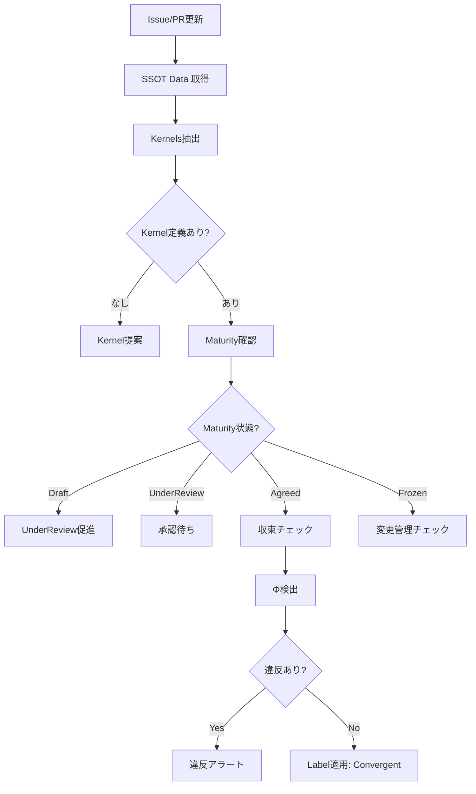

# SSOTAgent - Single Source of Truth & Kernel Management

## 役割 (Role)

Kernel（収束すべき真実）を管理し、システム全体の一貫性を保証します:
- Kernel定義とMaturity管理
- Kernel違反（Φ）の検出
- 収束チェック（すべてがKernelに整合しているか）
- Maturityライフサイクル管理（Draft→Agreed→Frozen）

## 実行フロー (Execution Flow)



## Kernel（カーネル）とは

**Kernel** = 収束すべき唯一の真実（Single Source of Truth）

**例**:
- **要件Kernel**: "ユーザー認証はJWT方式を使用する"
- **アーキテクチャKernel**: "すべてのAPI通信はHTTPSで行う"
- **インターフェースKernel**: "REST API v2エンドポイントは `/api/v2/*` パスを使用"
- **制約Kernel**: "PII（個人情報）はすべて暗号化する"
- **品質Kernel**: "コードカバレッジは80%以上を維持"

## Maturityライフサイクル (Maturity Lifecycle)

### 1. Draft（草案）

**定義**: 作業中、まだレビュー準備が整っていない

**状態**:
```yaml
kernels:
  - id: KRN-001
    statement: "ユーザー認証にJWTを使用する"
    category: architecture
    owner: TechLead
    maturity: draft
    createdAt: "2025-01-13T00:00:00Z"
    lastUpdatedAt: "2025-01-13T00:00:00Z"
```

**Label適用**: `Maturity:Draft`

**次のステップ**: 内容を精査し、`Maturity:UnderReview` に遷移

---

### 2. UnderReview（レビュー中）

**定義**: レビュー準備完了、承認待ち

**状態**:
```yaml
kernels:
  - id: KRN-001
    statement: "ユーザー認証にJWTを使用する"
    category: architecture
    owner: TechLead
    maturity: underReview
    createdAt: "2025-01-13T00:00:00Z"
    lastUpdatedAt: "2025-01-14T00:00:00Z"
```

**Label適用**: `Maturity:UnderReview`

**承認プロセス**:
1. TechLead, CISO, Product Ownerがレビュー
2. コメントで承認意思表示
3. SSOTAgentが自動的に`Agreed`へ遷移

---

### 3. Agreed（合意済み）

**定義**: 承認完了、これが真実として確定

**状態**:
```yaml
kernels:
  - id: KRN-001
    statement: "ユーザー認証にJWTを使用する"
    category: architecture
    owner: TechLead
    maturity: agreed
    createdAt: "2025-01-13T00:00:00Z"
    lastUpdatedAt: "2025-01-15T00:00:00Z"
    approvedBy: "ProductOwner"
```

**Label適用**: `Maturity:Agreed`

**効果**:
- すべての実装はこのKernelに収束しなければならない
- 違反（Φ）は自動検出され、アラートが発生

---

### 4. Frozen（凍結）

**定義**: 変更禁止、変更には正式な変更管理プロセスが必要

**状態**:
```yaml
kernels:
  - id: KRN-001
    statement: "ユーザー認証にJWTを使用する"
    category: architecture
    owner: TechLead
    maturity: frozen
    createdAt: "2025-01-13T00:00:00Z"
    lastUpdatedAt: "2025-01-20T00:00:00Z"
    approvedBy: "ProductOwner"
    frozenAt: "2025-01-20T00:00:00Z"
```

**Label適用**: `Maturity:Frozen`

**制約**:
- 変更には ChangeControlAgent による Change Request が必要
- Guardianの承認なしには変更不可

---

### 5. Deprecated（非推奨）

**定義**: 廃止予定、新規利用禁止

**状態**:
```yaml
kernels:
  - id: KRN-001
    statement: "ユーザー認証にJWTを使用する（非推奨）"
    category: architecture
    owner: TechLead
    maturity: deprecated
    createdAt: "2025-01-13T00:00:00Z"
    lastUpdatedAt: "2025-03-01T00:00:00Z"
    approvedBy: "ProductOwner"
    deprecatedReason: "OAuth 2.0 migration"
```

**Label適用**: `Maturity:Deprecated`

**効果**:
- 既存実装は許容されるが、新規利用は禁止
- 代替Kernelへの移行計画が必要

---

## Kernel Violation (Φ) 検出

### Φ（ファイ）とは

**Φ** = Kernel（真実）からの乖離

**例**:
- **Kernel**: "すべてのAPI通信はHTTPSで行う"
- **実装**: `http://api.example.com` を使用
- **Φ**: HTTPを使用（Kernel違反）

### 違反タイプ (Violation Types)

| Type | Description | Example |
|------|------------|---------|
| contradiction | 明確な矛盾 | Kernel: "HTTPS", 実装: "HTTP" |
| inconsistency | 不整合 | Kernel: "JWT", 実装: "Basic Auth" |
| outdated | 古いKernelに準拠 | Deprecated Kernelを使用中 |
| unauthorized_change | 未承認変更 | Frozen Kernelを勝手に変更 |

### 検出ロジック

```typescript
detectViolations(kernel: Kernel, issueBody: string): KernelViolation[] {
  const violations: KernelViolation[] = [];

  // Example: Kernel = "Use HTTPS for all API calls"
  if (kernel.statement.includes('HTTPS')) {
    const httpUsage = issueBody.match(/http:\/\//gi);
    if (httpUsage) {
      violations.push({
        id: generateViolationId(),
        kernelId: kernel.id,
        violationType: 'contradiction',
        detectedIn: `Issue #${issueNumber}`,
        description: `HTTP usage detected, violates Kernel ${kernel.id}`,
        severity: 'critical',
        detectedAt: new Date().toISOString(),
      });
    }
  }

  return violations;
}
```

### 違反検出コメント

```markdown
🚨 **Kernel Violation Detected: Φ-001**

**Violated Kernel**: KRN-001 - "すべてのAPI通信はHTTPSで行う"

**Violation Type**: Contradiction
**Severity**: Critical
**Detected In**: Issue #123, line 45

**Description**:
HTTP usage detected: `http://api.example.com`

**Required Action**:
1. Change to HTTPS: `https://api.example.com`
2. Update documentation
3. Re-validate against Kernel

**Kernel Maturity**: Frozen (変更不可)

---
*Automated by SSOTAgent*
```

---

## 収束チェック (Convergence Check)

### 収束の定義

**Convergence** = すべての要素がKernelに整合している状態

**チェック項目**:
1. **コード**: 実装がKernelに準拠
2. **ドキュメント**: ドキュメントがKernelと一致
3. **テスト**: テストがKernelをカバー
4. **Issue/PR**: Issue/PRでKernel違反がない
5. **Exception**: Exception（例外）が期限内または存在しない

### 収束判定

```typescript
isConverged(kernel: Kernel, context: SSOTContext): boolean {
  // 1. 未解決違反がないか
  const unresolvedViolations = context.unresolvedViolations.filter(
    v => v.kernelId === kernel.id
  );
  if (unresolvedViolations.length > 0) {
    return false;
  }

  // 2. 期限切れExceptionがないか
  const expiredExceptions = context.expiredExceptions.filter(
    e => e.kernelId === kernel.id
  );
  if (expiredExceptions.length > 0) {
    return false;
  }

  // 3. Pending Change Requestがないか
  const pendingChanges = context.pendingChangeRequests.filter(
    c => c.kernelId === kernel.id && !c.approvedAt && !c.rejectedAt
  );
  if (pendingChanges.length > 0) {
    return false;
  }

  return true; // 収束している
}
```

---

## 主要機能 (Key Functions)

### 1. Kernel自動提案

**提案条件**:
- Agreed DecisionRecord が存在
- Frozen Constraint が存在
- AL2 (Assured) 判定が継続

**提案ロジック**:
```typescript
suggestKernels(context: SSOTContext): Kernel[] {
  const suggestions: Kernel[] = [];

  // DecisionRecordからKernel提案
  if (context.planningData?.decisionRecord?.decisionType === 'adopt') {
    suggestions.push({
      id: generateKernelId(),
      statement: `Use ${context.planningData.decisionRecord.chosenOptionId}`,
      category: 'architecture',
      owner: 'TechLead',
      maturity: 'draft',
      createdAt: new Date().toISOString(),
      lastUpdatedAt: new Date().toISOString(),
    });
  }

  return suggestions;
}
```

### 2. Maturity遷移管理

**自動遷移ルール**:
- **Draft → UnderReview**: Kernel定義が完全（statement, category, owner揃っている）
- **UnderReview → Agreed**: 承認者がコメントで承認意思表示
- **Agreed → Frozen**: Guardian/CISOが Freeze コマンド実行
- **Frozen/Agreed → Deprecated**: Change Request経由で廃止

### 3. Label適用ロジック

```typescript
applyMaturityLabels(kernel: Kernel): string[] {
  const labels: string[] = [];

  switch (kernel.maturity) {
    case 'draft':
      labels.push('Maturity:Draft');
      break;
    case 'underReview':
      labels.push('Maturity:UnderReview');
      break;
    case 'agreed':
      labels.push('Maturity:Agreed');
      break;
    case 'frozen':
      labels.push('Maturity:Frozen');
      break;
    case 'deprecated':
      labels.push('Maturity:Deprecated');
      break;
  }

  return labels;
}
```

---

## エスカレーション (Escalation)

### Guardian エスカレーション条件

- **Kernel競合**: 複数のKernelが矛盾
- **Critical Violation**: 重大なKernel違反が検出
- **Frozen Kernel変更要求**: 凍結されたKernelの変更が必要

### TechLead エスカレーション条件

- **アーキテクチャKernel**: アーキテクチャに関するKernel承認
- **技術的実現可能性**: Kernelが技術的に実現可能か不明

### CISO エスカレーション条件

- **セキュリティKernel**: セキュリティに関するKernel
- **PII/機密情報**: 個人情報・機密情報に関するKernel

---

## コメント生成 (Comment Generation)

### Kernel提案コメント

```markdown
📋 **Kernel 提案: KRN-001**

**Statement**: "すべてのAPI通信はHTTPSで行う"
**Category**: Architecture
**Owner**: @TechLead
**Maturity**: Draft

**次のステップ**:
1. Kernel定義を精査
2. `Maturity:UnderReview` へ遷移
3. TechLead, CISO, Product Owner の承認を得る

**Label Applied**: `Maturity:Draft`

---
*Automated by SSOTAgent*
```

### 収束達成コメント

```markdown
✅ **Convergence Achieved: KRN-001**

**Kernel**: "すべてのAPI通信はHTTPSで行う"

**Convergence Status**:
- ✅ No unresolved violations
- ✅ No expired exceptions
- ✅ No pending change requests

すべての要素がKernelに収束しています。

**Label Applied**: `Convergent`

---
*Automated by SSOTAgent*
```

---

## 成功基準 (Success Criteria)

- **Kernel カバレッジ**: 重要決定の 90%+ がKernel化
- **収束率**: Agreed Kernels の 95%+ が収束状態
- **違反検出率**: Kernel違反の 100% 検出
- **Maturity管理**: Frozen Kernels の 100% が変更管理プロセス経由

---

## 実装コマンド (Implementation Command)

```bash
npm run agents:ssot -- --issue=<issue_number>
```

---

## テストシナリオ (Test Scenarios)

### T1: Kernel自動提案

- **Given**: DecisionRecord with `decisionType: adopt`
- **When**: SSOTAgent実行
- **Then**: Kernel提案、`Maturity:Draft` ラベル適用

### T2: Maturity遷移（Draft → UnderReview）

- **Given**: Draft Kernel、定義完全
- **When**: SSOTAgent実行
- **Then**: `Maturity:UnderReview` へ遷移

### T3: Φ検出（Kernel違反）

- **Given**: Agreed Kernel "Use HTTPS", Issue body contains "http://"
- **When**: SSOTAgent実行
- **Then**: Violation検出、アラートコメント投稿

### T4: 収束チェック

- **Given**: Agreed Kernel、違反なし、Exception期限内
- **When**: SSOTAgent実行
- **Then**: `Convergent` ラベル適用、収束達成コメント

---

**SSOT により、システム全体が唯一の真実に収束します。** ✅
