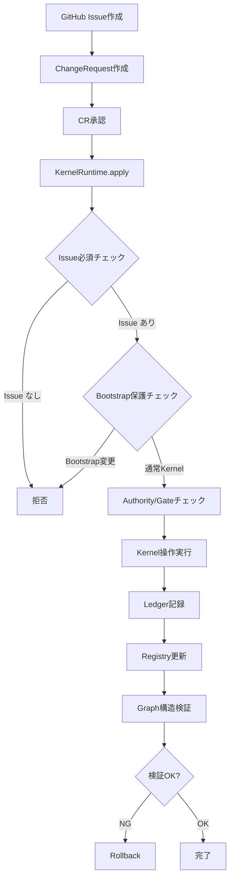

# luna

**世界最高の知識創造プラットフォーム** - Event Sourcing + Knowledge Graph + NRVV Traceability

[](https://github.com)
[](https://github.com)
[](LICENSE)

---

## 🌸 概要

**luna**は以下を統合した世界最高の知識創造プラットフォームです：

- **🏗️ Core Architecture (Phase A-C)**: Event Sourcing型の変更管理、型付き知識グラフ、Bootstrap Kernel
- **📚 Legacy Features**: Miyabiフレームワーク、DEST理論によるAL判定
- **🔄 Self-Improvement Loop**: 使えば使うほど賢くなるシステム

### 現在のステータス: Phase A-C & Issue #40 完了 ✅ (2026-02-08更新)

**Phase A-Cコアアーキテクチャ & Issue #40（Rules Configuration）が完了しました**：

- **✅ Phase A1: Kernel Runtime一本化** - すべてのKernel操作の単一エントリーポイント
- **✅ Phase A2: Kernel Ledger正本化** - Event Sourcing型の追記専用ログ、Replay機能
- **✅ Phase A3: CR-Runtime接続** - ChangeRequestからKernel操作の自動実行
- **✅ Phase B1: Kernel Graph Schema** - 型付き知識グラフ（10種ノード、8種エッジ）
- **✅ Phase C1: Issue一本道の運用固定** - すべての変更はIssue経由、Bootstrap Kernel保護
- **✅ Issue #40: Rules Configuration** - 人間-AI責任分界ルールの一元管理（`rules-config.yaml`）

**New Features**:
- 📝 **rules-config.yaml**: 人間-AI責任分界ルールを一元管理
- 🛠️ **Core Architecture Rules**: Kernel Runtime、Issue Enforcement、Bootstrap Protection、AL0 Gateの設定
- 🔒 **Environment-specific Deployment**: dev/staging/production環境ごとのデプロイ制御

**Lunaは使われるほど賢くなります**: すべての変更が追跡可能で、完全な監査証跡とRollback機能を持ちます。

---

## 🚀 クイックスタート

### 前提条件

```bash
node >= 20.0.0
npm >= 10.0.0
```

### インストール

```bash
# リポジトリをクローン
git clone https://github.com/your-org/luna.git
cd luna

# 依存関係をインストール
npm install

# ビルド
npm run build
```

### 🎯 ワンコマンド実行 - 自然文からIssue化・実行まで (NEW!)

Lunaは**自然文での指示から自動的にIssueを生成し、そのまま実行する**ワンコマンド導線をサポートしています：

```bash
# 1. 自然文 → Issue作成 → 即座に実行
npm run luna:do -- "ユーザー認証機能を追加したい"

# 2. 自然文 → Issue作成のみ（実行しない）
npm run luna:plan -- "ダークモードを実装したい"

# 3. 既存Issueを実行
npm run luna:run -- --issue 100

# 4. dry-runモード（プレビューのみ、Issue未作成）
npm run luna:do -- "キャッシュ機能を追加" --dry-run
npm run luna:plan -- "API rate limiting" --dry-run

# 5. 言語指定（日本語/英語/自動検出）
npm run luna:do -- "ユーザー認証機能を追加" --lang ja
npm run luna:plan -- "Add user authentication" --lang en
npm run luna:do -- "キャッシュ追加" --lang auto  # 自動検出（デフォルト）
```

**仕組み**:
1. AI（Claude Sonnet 4）が自然文からIssue本文を生成
2. DEST判定フィールドを自動的に含める（機械可読形式）
3. GitHub Issueを自動作成（ラベル付き）
4. `luna:do` の場合、Coordinatorを自動実行

**成功条件（RunContract）**:

RunContractは、各実行タイプが満たすべき最低品質基準を定義したルールです：

- **feature/enhancement**: 最低1ファイル生成 + 最低1 Kernel更新が必須
- **bug**: 0ファイルOK（設定変更のみの場合）、Kernel更新不要
- **test/docs/chore**: ファイル数・Kernel更新の制約なし
- **Phase Gate**: feature/enhancementはKernel最低保証をパス必須

**契約違反時の動作**:
- `overallStatus = failure`（偽成功を防止）
- 4つの違反タイプを記録：
  1. 生成ファイル不足（0/1）
  2. Kernel更新不足（0/1）
  3. Phase Gate失敗
  4. 必須項目欠落
- 違反内容は`run-metrics.ndjson`に永続化

**知識メトリクス**: 実行ごとに蓄積・活用状況を数値で表示
- `kernels_loaded/referenced/created/updated`
- `reuse_rate`: 再利用率 = referenced / loaded
- `convergence_delta`: 収束度 = (referenced + updated) / (loaded + created)

**必要な環境変数**:
```bash
GITHUB_TOKEN=<your-token>
GITHUB_REPOSITORY=owner/repo
ANTHROPIC_API_KEY=<your-key>
```

詳細は [docs/guides/GETTING_STARTED.md](./docs/guides/GETTING_STARTED.md) を参照してください。

### Phase A-C テスト実行

新しいコアアーキテクチャの動作確認：

```bash
# Phase A1+A2: Kernel Runtime + Ledger統合テスト
npx tsx scripts/test-phase-a1-a2-integration.ts

# Phase A3: CR-Runtime接続テスト
npx tsx scripts/test-phase-a3-cr-runtime.ts

# Phase B1: Kernel Graph Schemaテスト
npx tsx scripts/test-phase-b1-graph-schema.ts

# Phase C1: Bootstrap Kernel保護テスト
npx tsx scripts/test-phase-c1-bootstrap.ts

# 全テスト実行
npm test

# カバレッジ付き実行
npm run test:coverage
```

**Phase A-C実装内容**:
- ✅ 6つのKernel操作（u.record_decision, u.link_evidence, u.set_state等）
- ✅ Event Sourcing型Ledger（append-only、Replay機能）
- ✅ ChangeRequest自動実行
- ✅ 型付き知識グラフ（10種類のノード、8種類のエッジ）
- ✅ Bootstrap Kernel保護（不変ルール）

### Phase A-C対応Issueの作成

Phase A-Cアーキテクチャでは、すべての変更はIssue経由で行います：

```markdown
# [Issue タイトル]

[問題や機能の説明]

## 変更内容
- [変更したいKernelまたは新規作成するKernelの説明]
- [NRVV (Needs-Requirements-Verification-Validation) の情報]

## 関連Kernel
- [関連するKernel IDがあれば記載]

## 期待される結果
- [変更後の期待される状態]
```

**例**:

```markdown
# セキュリティ基準の追加

HTTPSとJWT認証を必須化するセキュリティKernelを作成します。

## 変更内容
- Kernel ID: KRN-SEC-001
- Statement: "すべての通信はHTTPSを使用し、JWT認証を実装する"
- Category: security
- Requirements:
  - REQ-001: HTTPSを必須とする（TLS 1.2以上）
  - REQ-002: JWT認証を実装する（トークン有効期限1時間）

## 関連Kernel
- なし（新規作成）

## 期待される結果
- セキュリティKernelがfrozen状態で作成される
- Verification/Validationが自動生成される
- 他のKernelからの参照が可能になる
```

**処理フロー**:
1. Issue作成 → ChangeRequest作成
2. CR承認 → `KernelRuntime.apply()` で自動実行
3. Ledgerに記録 → Registry更新
4. Graph構造検証 → 完了

---

## 📊 RunContract: 実行品質保証

### 契約違反とは

RunContractは、**Lunaが約束した最低品質基準を満たさなかった証拠**です。以前は「feature実装で0ファイル生成」という明らかな失敗が `success` と判定される「偽成功」問題がありました。

### 契約違反の検出フロー

```
1. CodeGenAgent
   ↓ 0ファイル生成を検出
   ↓ feature/enhancementの場合 → 即座にエラー

2. CoordinatorAgent
   ↓ RunContract検証
   ↓ 4つの契約違反を検出

3. RunMetricsService
   ↓ run-metrics.ndjsonに記録
   ↓ 永続化された監査証跡
```

### 契約違反の例（Issue #56）

```json
{
  "execution_type": "feature",
  "status": "failure",
  "generated_files": 0,
  "kernel_updates": 0,
  "violation_reasons": [
    "Generated files (0) below minimum (1) for feature",
    "Kernel updates (0) below minimum (1) for feature",
    "Phase Gate failed: Phase 0.5: SSOT Pre-execution - No Kernels created or updated",
    "  Missing: At least 1 Kernel required for feature/enhancement"
  ]
}
```

### 契約違反の価値

| 側面 | 契約なし（以前） | 契約あり（現在） |
|------|----------------|----------------|
| **検出** | なし | 即座に検出 |
| **通知** | 「成功しました」 | 「4つの違反」 |
| **原因** | 不明 | 具体的に記録 |
| **改善** | できない | 明確な指針 |
| **監査** | 証拠なし | ndjsonに永続化 |

詳細は [src/types/run-contract.ts](./src/types/run-contract.ts) を参照してください。

---

## 📦 ワークスペース

Lunaはモノレポ構造を採用しており、複数のプロジェクトを管理できます。

### プロジェクト構造

```
luna/
├── src/               # Lunaコアライブラリ
├── tests/             # コアテスト
├── examples/          # サンプルプロジェクト
│   └── simple-app/    # シンプルなサンプルアプリ
└── workspaces/        # ユーザープロジェクト用
```

### サンプルアプリの実行

```bash
# サンプルアプリを実行
cd examples/simple-app
npm run dev
```

### 新規プロジェクトの作成

```bash
# ワークスペースに新規プロジェクトを作成
cd workspaces
mkdir my-project
cd my-project

# プロジェクトを初期化
npm init -y

# Lunaを依存関係に追加
npm install luna --workspace=workspaces/my-project
```

詳細は [workspaces/README.md](workspaces/README.md) を参照してください。

### 利用可能な機能

ワークスペース内のプロジェクトでは、Lunaのすべての機能を使用できます：

- **DEST Theory**: AL0判定、Protocol適用
- **Planning Layer**: 意思決定管理、前提追跡 (Phase 3完成)
- **SSOT**: 真実の一元管理 (Phase 4)
- **Agents**: 自律型開発エージェント
  - **CodeGenAgent**: AI駆動コード生成 (Claude Sonnet 4統合)
  - **ReviewAgent**: コード品質判定 (80点以上で合格)
  - **TestAgent**: 自動テスト実行 (80%カバレッジ目標)
  - **DeploymentAgent**: 自動デプロイ & ロールバック
  - **MonitoringAgent**: システム監視 & アラート管理

---

## 📊 Phase A-C のメリット

### なぜPhase A-Cが重要か？

**従来の課題**:
- Kernel変更が追跡不可能（誰が、いつ、なぜ変更したか不明）
- Rollbackが困難（過去の状態に戻せない）
- NRVV構造が弱い（Needsと Requirementsのトレーサビリティが不十分）
- 変更の一貫性が保証されない（直接YAMLを編集すると矛盾が生じる）

**Phase A-Cで解決**:
- ✅ **完全な監査証跡**: すべての変更がLedgerに記録される
- ✅ **Rollback可能**: Event Sourcing により任意の時点に復元可能
- ✅ **NRVV構造の強制**: 型付き知識グラフで構造を検証
- ✅ **変更の一貫性**: 単一エントリーポイント経由でのみ変更可能
- ✅ **Issue一本道**: すべての変更の起点がIssueで明確

### Phase A-C vs 従来のアプローチ

| 項目 | 従来 | Phase A-C |
|-----|------|----------|
| **変更方法** | YAML直接編集 | `KernelRuntime.apply(op)` |
| **履歴管理** | Git commitのみ | Event Sourcing Ledger |
| **Rollback** | Git revert（部分的） | 完全な状態復元 |
| **NRVV検証** | 手動チェック | 自動グラフ検証 |
| **監査証跡** | コミットログ | 詳細な操作ログ |
| **変更の起点** | 不明確 | Issue必須 |

---

## 🏗️ Core Architecture (Phase A-C) - NEW

### アーキテクチャ概要

```
┌─────────────────────────────────────────────────────────┐
│                   GitHub Issues                         │
│            (変更の唯一の起点 - Issue一本道)              │
└─────────────────┬───────────────────────────────────────┘
                  │
                  ▼
┌─────────────────────────────────────────────────────────┐
│            ChangeRequest (CR)                           │
│        (形式的な変更管理、承認フロー)                     │
└─────────────────┬───────────────────────────────────────┘
                  │
                  ▼
┌─────────────────────────────────────────────────────────┐
│          KernelRuntime.apply(op)                        │
│     (すべてのKernel操作の単一エントリーポイント)          │
│  ┌─────────────────────────────────────────────────┐   │
│  │ u.record_decision  - 意思決定を記録              │   │
│  │ u.link_evidence    - 証拠を紐付け               │   │
│  │ u.set_state        - 状態を遷移                 │   │
│  │ u.raise_exception  - 例外を記録                 │   │
│  │ u.close_exception  - 例外を解決                 │   │
│  └─────────────────────────────────────────────────┘   │
└─────────────────┬───────────────────────────────────────┘
                  │
                  ▼
┌─────────────────────────────────────────────────────────┐
│           Kernel Ledger (Event Sourcing)                │
│         (append-only操作ログ、完全な監査証跡)            │
│  ┌─────────────────────────────────────────────────┐   │
│  │ - NDJSON形式で永続化                             │   │
│  │ - すべての操作を追跡可能                          │   │
│  │ - Replay機能で状態を再構築                       │   │
│  │ - Rollback可能                                  │   │
│  └─────────────────────────────────────────────────┘   │
└─────────────────┬───────────────────────────────────────┘
                  │
                  ▼
┌─────────────────────────────────────────────────────────┐
│        Kernel Registry (YAML)                           │
│    (Kernelの現在状態、NRVV情報を保持)                    │
│  ┌─────────────────────────────────────────────────┐   │
│  │ - Needs → Requirements (トレーサビリティ)         │   │
│  │ - Requirements → Verification (検証)            │   │
│  │ - Requirements → Validation (妥当性確認)         │   │
│  │ - Decision、Evidence、Exceptionsを含む           │   │
│  └─────────────────────────────────────────────────┘   │
└─────────────────┬───────────────────────────────────────┘
                  │
                  ▼
┌─────────────────────────────────────────────────────────┐
│         Kernel Graph (型付き知識グラフ)                  │
│    (NRVV構造を強制、トレーサビリティを視覚化)              │
│  ┌─────────────────────────────────────────────────┐   │
│  │ - 10種類のノード (Kernel, Decision, Need等)      │   │
│  │ - 8種類のエッジ (satisfies, verifies等)         │   │
│  │ - グラフ制約の検証（孤立ノード、サイクル検出）      │   │
│  │ - トレーサビリティマトリクス生成                   │   │
│  └─────────────────────────────────────────────────┘   │
└─────────────────────────────────────────────────────────┘
```

### システムコンポーネント

```
luna/
├── src/
│   ├── types/
│   │   ├── kernel-operations.ts  # Phase A1: 5つのu.*操作定義
│   │   ├── kernel-graph.ts       # Phase B1: グラフ型定義
│   │   ├── nrvv.ts              # NRVV構造（Decision, Evidence含む）
│   │   └── change-control.ts    # Phase A3: CR操作詳細
│   ├── ssot/
│   │   ├── kernel-runtime.ts    # Phase A1: 単一エントリーポイント
│   │   ├── kernel-ledger.ts     # Phase A2: Event Sourcing Ledger
│   │   ├── kernel-graph-converter.ts  # Phase B1: YAML↔Graphコンバーター
│   │   └── kernel-graph-validator.ts  # Phase B1: グラフ制約検証
│   └── agents/
│       └── change-control-agent.ts    # Phase A3: CR自動実行
├── data/
│   └── ssot/
│       ├── bootstrap-kernel.yaml      # Phase C1: 不変ルール定義
│       ├── kernels-luna-base.yaml     # メインKernel Registry
│       └── ledger.ndjson             # Event Sourcingログ
├── scripts/
│   ├── test-phase-a1-a2-integration.ts  # A1+A2統合テスト
│   ├── test-phase-a3-cr-runtime.ts      # A3 CRテスト
│   ├── test-phase-b1-graph-schema.ts    # B1 Graphテスト
│   └── test-phase-c1-bootstrap.ts       # C1 Bootstrapテスト
└── README.md（このファイル）
```

### Phase A-C 詳細説明

#### Phase A1: Kernel Runtime一本化

**目的**: すべてのKernel変更を単一のエントリーポイント経由で実行

**実装**: `KernelRuntime.apply(op)` メソッド

**5つのu.*操作**:
- `u.record_decision` - 意思決定を記録（AL、反証条件等）
- `u.link_evidence` - 証拠をKernelに紐付け
- `u.set_state` - Kernel状態を遷移（draft→agreed→frozen等）
- `u.raise_exception` - 例外（逸脱）を記録
- `u.close_exception` - 例外を解決

**メリット**:
- 変更の一貫性を保証
- Authority（権限）チェックを一箇所で実施
- Gateチェック（状態遷移の妥当性）を強制

#### Phase A2: Kernel Ledger正本化

**目的**: Event Sourcing型の変更管理、完全な監査証跡

**実装**: `KernelLedger` クラス（NDJSON形式）

**特徴**:
- **append-only**: 過去の操作は絶対に削除されない
- **Replay機能**: 操作ログから現在の状態を完全に再構築可能
- **Rollback可能**: 任意の時点の状態に復元可能
- **監査証跡**: すべての変更が追跡可能（誰が、いつ、なぜ）

**ファイル形式**: `data/ssot/ledger.ndjson`（1行 = 1操作）

#### Phase A3: CR-Runtime接続

**目的**: ChangeRequestから自動的にKernel操作を実行

**実装**: `ChangeControlAgent` + `KernelRuntime` 統合

**フロー**:
1. ChangeRequestを作成（`operation_details`を含む）
2. 承認後、`executeChangeRequest()` を呼び出し
3. 各操作が自動的に `KernelRuntime.apply()` で実行される
4. 実行結果が `execution_results` に記録される

**メリット**:
- 形式的な変更管理プロセス
- 承認フローとKernel更新の自動連携
- 実行結果の記録

#### Phase B1: Kernel Graph Schema

**目的**: 型付き知識グラフによるNRVV構造の強制

**実装**: `KernelGraphConverter` + `KernelGraphValidator`

**ノードタイプ（10種類）**:
- Kernel, Decision, Need, Requirement, Verification, Validation, Evidence, Exception, Task, Artifact

**エッジタイプ（8種類）**:
- derived_from, satisfies, verifies, validates, references, blocked_by, depends_on, traces_to

**検証機能**:
- 孤立ノード検出
- サイクル検出
- 必須エッジのチェック（例: RequirementはNeedから派生必須）
- 禁止エッジのチェック
- トレーサビリティマトリクス生成

#### Phase C1: Issue一本道の運用固定

**目的**: すべての変更をIssue経由に限定、Bootstrap Kernel保護

**実装**: Bootstrap Kernel + 強制機能

**Bootstrap Kernel** (`data/ssot/bootstrap-kernel.yaml`):
- **不変ルール**: "すべてのKernel変更はIssue経由で行われる"
- **immutable: true**: 変更禁止フラグ
- **frozen状態**: 凍結された不変Kernel

**強制機能**:
- `enforceIssueRequired`: Issue番号なしの操作を拒否
- `enforceBootstrapProtection`: Bootstrap Kernelの変更を禁止

**メリット**:
- 変更のトレーサビリティを保証
- システムの根本ルールを保護
- 運用の一貫性を強制

### ワークフロー統合 (Phase A-C)



---

---

## 📚 Legacy Features (Pre-Phase A-C)

以下の機能は Phase A-C 実装前に開発されたレガシー機能です。現在も動作しますが、新しいアーキテクチャへの移行を推奨します。

### Legacy: DEST理論統合

<details>
<summary>DEST理論の詳細を表示</summary>

**DEST（Decision-Embedded Systems Thinking）**は、システム介入を以下に基づいて評価する理論です：

1. **Outcome OK**: システムは目標状態に向けて進捗しているか？
2. **Safety OK**: フィードバックループは安定しているか？安全制約は満たされているか？

#### Assurance Level（保証レベル）

| AL | 名称 | 条件 | 意味 | アクション |
|----|------|------|------|-----------|
| **AL2** | 保証あり | outcome_ok **AND** safety_ok | デプロイ安全 | ✅ `deploying`許可 |
| **AL1** | 条件付き | outcome_ok **AND NOT** safety_ok | 条件付き承認 | ⚠️ 注意深く監視 |
| **AL0** | 保証なし | **NOT** safety_ok | 安全でない | 🚫 `implementing`ブロック |

#### AL0 Reason（失敗パターン：R01-R11）

IssueがAL0と判定された場合、DESTAgentはどの失敗パターンが該当するかを検出します。

詳細は [`docs/input/dest.yaml`](./docs/input/dest.yaml) を参照してください。

</details>

### Legacy: Miyabiフレームワーク

<details>
<summary>Miyabi 8つのエージェントの詳細を表示</summary>

Miyabiフレームワークは以下の8つの自律エージェントで構成されています：

1. **CoordinatorAgent** - タスク統括・並列実行制御
2. **SSOTAgentV2** - Single Source of Truth管理
3. **CodeGenAgent** - AI駆動コード生成
4. **ReviewAgent** - コード品質判定
5. **TestAgent** - テスト自動実行
6. **DeploymentAgent** - CI/CDデプロイ自動化
7. **MonitoringAgent** - システム監視・アラート
8. **KernelRegistryService** - 中央Kernel管理

詳細は [`CLAUDE.md`](./CLAUDE.md) を参照してください。

</details>

---

## ⚙️ ルール設定

### rules-config.yaml - 人間-AI責任分界の一元管理

Lunaでは、**人間-AI責任分界**（どの判断を人間が行い、どの判断をAIが行うか）を`rules-config.yaml`ファイルで一元管理できます。

**主な機能**:
- ✅ **一元管理**: 全てのルールが1ファイルで管理される
- ✅ **理由の明記**: 各ルールに`rationale`（理由）が記録される
- ✅ **変更履歴**: ルール変更が自動的に記録される
- ✅ **後方互換性**: 環境変数へのフォールバック対応
- ✅ **バリデーション**: 設定ミスを自動検出

### 設定例

```yaml
# rules-config.yaml
human_ai_boundary:
  # Phase 0: DEST Judgment
  dest_judgment:
    enabled: true
    rationale: "Issue実装前の価値判断は人間の責任範囲"
    al_threshold:
      block_below: "AL0"        # AL0: 実装ブロック
      require_approval: "AL1"   # AL1: 人間承認必要
      auto_proceed: "AL2"       # AL2以上: 自動進行可能

  # Phase 1: Planning Layer
  planning_layer:
    enabled: true
    rationale: "解決策探索は人間の意思決定支援が必要"
    creps_gates:
      enabled: true
      threshold: 70  # 70点以下は人間レビュー必要

  # Phase 4-5: Code Generation & Review
  code_generation:
    enabled: true
    quality_threshold: 80  # 80点以上で合格
    generate_tests: true
    test_coverage_target: 80

  review_required:
    enabled: true
    rationale: "生成コードは必ず人間がレビュー"
    min_quality_score: 80
```

### カスタマイズ

**より厳格な品質基準**:
```yaml
code_generation:
  quality_threshold: 90  # 90点以上を要求
  test_coverage_target: 90

review_required:
  min_quality_score: 90
```

**DESTを無効化（テスト環境）**:
```yaml
dest_judgment:
  enabled: false
  rationale: "テスト環境のためDEST無効化"
```

詳細は [RULES_CONFIGURATION.md](./RULES_CONFIGURATION.md) を参照してください。

---

## 🧪 テスト

### テストカバレッジ

```bash
npm run test:coverage
```

**期待カバレッジ**: 全モジュールで80%以上

### テストファイル

1. **al-judge.test.ts**（16テスト）
   - AL判定ロジック（AL0/AL1/AL2）
   - Outcome評価パース
   - Safety評価パース
   - エッジケース

2. **al0-reason-detector.test.ts**（16テスト）
   - R01-R11パターンマッチング
   - 複数理由検出
   - 信頼度スコアリング
   - 日本語キーワード対応

3. **protocol-router.test.ts**（24テスト）
   - P0-P4ルーティング
   - 優先度処理
   - エスカレーションレベル判定
   - 次のアクション生成

**合計**: 56テスト

---

## 📦 依存関係

### 本番環境
- `@octokit/rest`: GitHub REST APIクライアント
- `@anthropic-ai/sdk`: Claude AI統合（オプション）
- `commander`: CLIパース
- `dotenv`: 環境変数管理

### 開発環境
- `typescript`: 型安全JavaScript
- `tsx`: TypeScript実行
- `vitest`: 高速ユニットテスト
- `@vitest/coverage-v8`: コードカバレッジ

---

## 🔐 セキュリティ

### 環境変数

**必須**:
- `GITHUB_TOKEN`: `repo`スコープ付きGitHub Personal Access Token

**オプション**:
- `ANTHROPIC_API_KEY`: AI分析用Anthropic APIキー
- `GITHUB_OWNER`: リポジトリオーナー（デフォルト: git remoteから取得）
- `GITHUB_REPO`: リポジトリ名（デフォルト: git remoteから取得）

### ベストプラクティス

- **絶対にコミットしない**: `.env`をgitに含めない（`.gitignore`に含まれています）
- **GitHub Secrets使用**: CI/CDワークフローではGitHub Secretsを使用
- **定期的なトークンローテーション**
- **最小権限の原則**

---

## 🎯 成功メトリクス（Phase A-C）

| メトリクス | 目標 | 現在 |
|-----------|------|------|
| Kernel操作の一本化 | 100% | ✅ 5つのu.*操作すべて実装 |
| Event Sourcing Ledger | append-only | ✅ NDJSON形式で実装 |
| Replay機能 | 完全な状態再構築 | ✅ 6操作のReplay成功 |
| CR-Runtime統合 | 自動実行 | ✅ 3操作の自動実行成功 |
| Graph Schema検証 | 制約チェック | ✅ 孤立ノード/サイクル検出 |
| Bootstrap Kernel保護 | 不変保証 | ✅ 変更拒否を確認 |
| Issue必須強制 | 100%強制 | ✅ Issue なし操作を拒否 |
| テストカバレッジ | すべてPass | ✅ 4つのPhaseテスト全合格 |

---

## 🗺️ ロードマップ

### ✅ Phase A-C: Core Architecture (2026-02-08) - **完了**

- [x] **Phase A1**: Kernel Runtime一本化 - `KernelRuntime.apply(op)` 単一エントリーポイント
- [x] **Phase A2**: Kernel Ledger正本化 - Event Sourcing、append-only、Replay機能
- [x] **Phase A3**: CR-Runtime接続 - ChangeRequestから自動実行
- [x] **Phase B1**: Kernel Graph Schema - 型付き知識グラフ、NRVV構造強制
- [x] **Phase C1**: Issue一本道の運用固定 - Bootstrap Kernel、Issue必須強制
- [x] 包括的テストスイート（4つのPhaseテスト、すべて合格）

### 🔜 Phase D: Self-Improvement Loop強化

**P0課題**: Self-Improvement Loopの完成（推定: 2-4時間）

- [ ] CoordinatorAgentデータフロー修正（Phase 0.5: SSot先行実行）
- [ ] CodeGenAgentのKernel連携確認（既存実装の検証）
- [ ] TestAgentのVerification記録確認（既存実装の検証）
- [ ] E2Eテスト実行（Issue → Kernel自動変換 → Code生成 → Test記録）

**P1課題**: Self-Improvement Loop高度化

- [ ] Issue → Kernel 自動変換の強化（AI でIssue bodyからNRVVを抽出）
- [ ] Kernel Convergence 自動監視（週次で収束率をチェック）
- [ ] NRVV 自動補完（RequirementsからVerification/Validationを提案）

### 🔜 Phase E: Planning Layer統合

- [ ] Opportunity、Option、Decisionの管理
- [ ] AssumptionTrackerAgent（Assumption無効化追跡）
- [ ] DecisionRecord YAMLスキーマ
- [ ] Kernel RuntimeへのPlanning統合

### 🔜 Phase F: 本番運用最適化

- [ ] パフォーマンスチューニング（大規模Kernel Registry対応）
- [ ] バックアップ・リストア機能
- [ ] 監視・アラート機能
- [ ] ドキュメント自動生成

**最終ビジョン**: 使えば使うほど賢くなる、世界最高の知識創造プラットフォーム

---

## 🤝 コントリビューション

このプロジェクトは**識学理論（Shikigaku Theory）**の組織原則に従っています：

1. **責任の明確化** - 各エージェントが特定の責任を保有
2. **権限の委譲** - エージェントが自律的に意思決定
3. **階層の設計** - CoordinatorAgent → 専門エージェント
4. **結果の評価** - 品質スコア、カバレッジ、実行時間で測定
5. **曖昧性の排除** - DAG依存関係、状態ラベル、明確な遷移

### 開発ワークフロー

1. DESTフィールド（Outcome/Safety Assessment）付きでIssue作成
2. DESTAgentが自動的にAL判定
3. AL0の場合：ProtocolごとにAL0 Reasonを解決
4. AL1以上の場合：CoordinatorAgentがタスク分解
5. 専門エージェントが実行（CodeGen、Review、Testなど）
6. デプロイ前にAL2必須

---

## 📖 ドキュメント

### エントリーポイント
- **[README.md](./README.md)**: プロジェクト概要（このファイル）
- **[CLAUDE.md](./CLAUDE.md)**: Claude Code統合とmiyabiフレームワーク概要

### ガイド（完成成果物）
📁 `docs/guides/`
- **[GETTING_STARTED.md](./docs/guides/GETTING_STARTED.md)**: クイックスタートガイド
- **[SETUP_GUIDE.md](./docs/guides/SETUP_GUIDE.md)**: 詳細なセットアップ手順
- **[RULES_CONFIGURATION.md](./docs/guides/RULES_CONFIGURATION.md)**: ルール設定ガイド（人間-AI責任分界）
- **[DEVELOPMENT.md](./docs/guides/DEVELOPMENT.md)**: 開発ガイド
- **[PRODUCTION_READINESS.md](./docs/guides/PRODUCTION_READINESS.md)**: 本番準備ガイド
- **[MVP_VERIFICATION.md](./docs/guides/MVP_VERIFICATION.md)**: MVP検証ガイド
- **[SELF_IMPROVEMENT_GUIDE.md](./docs/guides/SELF_IMPROVEMENT_GUIDE.md)**: Self-Improvement Loop ガイド

### 理論的基盤（インプット）
📁 `docs/input/`
- **[dest.yaml](./docs/input/dest.yaml)**: DEST理論仕様（Problem Space）
- **[unified_planning_and_ssot_framework.yaml](./docs/input/unified_planning_and_ssot_framework.yaml)**: Planning + SSOT Layer仕様（Solution Space）
- **[LUNA_VISION_AND_ARCHITECTURE.md](./docs/input/LUNA_VISION_AND_ARCHITECTURE.md)**: Lunaビジョンとアーキテクチャ
- **[AI_HUMAN_ROLE_CONTRACT.md](./docs/input/AI_HUMAN_ROLE_CONTRACT.md)**: 人間-AI責任分界の契約
- **[MBSE_SIMULATION_FRAMEWORK.md](./docs/input/MBSE_SIMULATION_FRAMEWORK.md)**: MBSEシミュレーション基盤
- **[CORE_ARCHITECTURE_PROPOSAL.md](./docs/input/CORE_ARCHITECTURE_PROPOSAL.md)**: コアアーキテクチャ提案

### 実装レポート（中間生成物）
📁 `docs/reports/`
- **[issues/](./docs/reports/issues/)**: Issue完了報告（#21-#25等）
- **[analysis/](./docs/reports/analysis/)**: ギャップ分析レポート
- **[progress/](./docs/reports/progress/)**: 進捗状況レポート

### エージェント仕様
📁 `.claude/agents/`
- 個別エージェント仕様書（DESTAgent、CoordinatorAgent等）

---

## 🔗 リンク

- **Miyabiフレームワーク**: [GitHub](https://github.com/ShunsukeHayashi/Autonomous-Operations)
- **DEST理論**: `dest.yaml`で完全仕様を参照
- **Issueテンプレート**: `.github/ISSUE_TEMPLATE/`

---

## 📄 ライセンス

MITライセンス - 詳細は[LICENSE](LICENSE)を参照

---

## 💬 サポート

- **Issues**: DESTテンプレート付きGitHub Issueを使用
- **質問**: `❓question`ラベルを追加
- **バグ**: `🐛bug`ラベル + DEST Outcome/Safety Assessment

---

🌸 **luna** - 自律型知識創造における美

*Powered by Miyabi × DEST理論 × Planning Layer × SSOT Layer*

---

**ステータス**: Phase A-C完了 ✅ (2026-02-08) | Core Architecture実装完了

**次のステップ**: Phase D（Self-Improvement Loop強化） → Phase E（Planning Layer統合） → Phase F（本番運用最適化）

**重要な変更**:
- ✅ Event Sourcing型の変更管理（完全な監査証跡、Rollback可能）
- ✅ 型付き知識グラフ（NRVV構造の強制、トレーサビリティ）
- ✅ Issue一本道の運用（Bootstrap Kernel保護、変更の起点を一元化）
- ✅ 使えば使うほど賢くなる基盤（Self-Improvement Loop）
