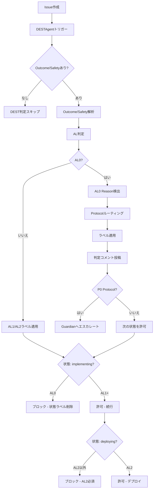

# luna

**世界最高の知識創造プラットフォーム** - Miyabi + DEST理論による自律型開発

[](https://github.com)
[](https://github.com)
[](LICENSE)

---

## 🌸 概要

**luna**は以下を統合した世界最高の知識創造プラットフォームです：

- **Miyabiフレームワーク**: GitHub完結型自律開発OS、7つの専門エージェント
- **DEST理論**: Decision-Embedded Systems Thinking（意思決定埋め込み型システム思考）によるAssurance Level (AL)判定
- **Planning Layer**: Opportunity、Option、Decision、Assumptionの管理（Phase 3）
- **SSOT Layer**: Kernel管理による単一情報源（Phase 4）

### 現在のステータス: Phase 1 MVP - DEST AL判定システム ✅

Phase 1では、すべてのGitHub Issue/PRに対する**Assurance Level (AL)**の自動判定を実装しました：

- **AL2（保証あり）**: outcome_ok AND safety_ok → デプロイ可能
- **AL1（条件付き）**: outcome_ok BUT safety要監視 → 条件付き承認
- **AL0（保証なし）**: safety NG または重大な不確実性 → 解決まで実装ブロック

**AL0のIssue**は自動的に**AL0 Reason**（R01-R11）を分析され、適切な**Protocol**（P0-P4）とエスカレーションへルーティングされます。

---

## 🚀 クイックスタート

### 前提条件

```bash
node >= 20.0.0
npm >= 10.0.0
```

### インストール

```bash
# リポジトリをクローン
git clone https://github.com/your-org/luna.git
cd luna

# 依存関係をインストール
npm install

# 環境変数を設定
cp .env.example .env
# .envを編集して以下を追加:
# GITHUB_TOKEN=ghp_xxxxx
# ANTHROPIC_API_KEY=sk-ant-xxxxx (AI分析に必要、オプション)
```

### テスト実行

```bash
# 全テスト実行
npm test

# カバレッジ付き実行
npm run test:coverage

# Watchモード
npm run test:watch
```

**テスト結果**: AL判定、AL0 Reason検出、Protocolルーティングをカバーする56個のテスト

### DEST対応Issueの作成

以下のテンプレートでIssueを作成してください：

```markdown
# [Issue タイトル]

[問題や機能の説明]

## Outcome Assessment
- Current state: [現在の状態を記述]
- Target state: [目標とする状態を記述]
- Progress: [improving/stable/degrading]

## Safety Assessment
- Feedback loops: [stable/oscillating/amplifying]
- Safety constraints: [安全要件をリスト]
- Violations: [none / 違反があればリスト]
```

**例**:

```markdown
# APIレスポンス時間改善

APIレスポンス時間が現在2.5秒で、500ms以下にする必要があります。

## Outcome Assessment
- Current state: APIレスポンス時間2.5秒
- Target state: APIレスポンス時間 < 500ms
- Progress: degrading（悪化中）

## Safety Assessment
- Feedback loops: oscillating（パラメータ調整のみで構造に対応していない）
- Safety constraints: SLA 99.9%稼働率、最大1秒レスポンス時間
- Violations: SLA違反寸前（2.5秒 > 1秒）
```

**DESTAgent**が自動的に：
1. AL判定（この場合：**AL0**）
2. AL0 Reason検出（この場合：**R02-DelayIgnored**、**R07-ParameterOnlyFix**）
3. Protocolへルーティング（この場合：**P2-AlignDelay** + **P3-RaiseLeverage**）
4. ラベル適用と判定コメント投稿
5. AL0解決まで`implementing`状態をブロック

---

## 📦 ワークスペース

Lunaはモノレポ構造を採用しており、複数のプロジェクトを管理できます。

### プロジェクト構造

```
luna/
├── src/               # Lunaコアライブラリ
├── tests/             # コアテスト
├── examples/          # サンプルプロジェクト
│   └── simple-app/    # シンプルなサンプルアプリ
└── workspaces/        # ユーザープロジェクト用
```

### サンプルアプリの実行

```bash
# サンプルアプリを実行
cd examples/simple-app
npm run dev
```

### 新規プロジェクトの作成

```bash
# ワークスペースに新規プロジェクトを作成
cd workspaces
mkdir my-project
cd my-project

# プロジェクトを初期化
npm init -y

# Lunaを依存関係に追加
npm install luna --workspace=workspaces/my-project
```

詳細は [workspaces/README.md](workspaces/README.md) を参照してください。

### 利用可能な機能

ワークスペース内のプロジェクトでは、Lunaのすべての機能を使用できます：

- **DEST Theory**: AL0判定、Protocol適用
- **Planning Layer**: 意思決定管理、前提追跡 (Phase 3完成)
- **SSOT**: 真実の一元管理 (Phase 4)
- **Agents**: 自律型開発エージェント
  - **CodeGenAgent**: AI駆動コード生成 (Claude Sonnet 4統合)
  - **ReviewAgent**: コード品質判定 (80点以上で合格)
  - **TestAgent**: 自動テスト実行 (80%カバレッジ目標)
  - **DeploymentAgent**: 自動デプロイ & ロールバック
  - **MonitoringAgent**: システム監視 & アラート管理

---

## 📊 DEST理論統合

### DESTとは？

**DEST（Decision-Embedded Systems Thinking）**は、システム介入を以下に基づいて評価する理論です：

1. **Outcome OK**: システムは目標状態に向けて進捗しているか？
2. **Safety OK**: フィードバックループは安定しているか？安全制約は満たされているか？

### Assurance Level（保証レベル）

| AL | 名称 | 条件 | 意味 | アクション |
|----|------|------|------|-----------|
| **AL2** | 保証あり | outcome_ok **AND** safety_ok | デプロイ安全 | ✅ `deploying`許可 |
| **AL1** | 条件付き | outcome_ok **AND NOT** safety_ok | 条件付き承認 | ⚠️ 注意深く監視 |
| **AL0** | 保証なし | **NOT** safety_ok | 安全でない | 🚫 `implementing`ブロック |

**Safetyが第一ゲート**: safetyがNGの場合、outcomeに関係なく必ずAL0になります。

### AL0 Reason（失敗パターン：R01-R11）

IssueがAL0と判定された場合、DESTAgentはどの失敗パターンが該当するかを検出します：

| コード | 理由 | 説明 | Protocol |
|--------|------|------|----------|
| **R01** | 悪い正のフィードバック | 破壊的増幅を検出 | **P0** 増幅停止 |
| **R02** | 遅れ無視 | 遅れを無視、振動リスク | **P2** 遅れ整合 |
| **R03** | 負のフィードバック弱化 | 安定化フィードバックを除去 | **P1** 観測修正 |
| **R04** | 反復介入 | 継続的な手動介入（連打） | **P0** 増幅停止 |
| **R05** | 観測断絶 | フィードバックなし、盲点 | **P1** 観測修正 |
| **R06** | 誤った観測対象 | 間違ったものを測定 | **P1** 観測修正 |
| **R07** | パラメータ調整のみ | 構造変更なしのチューニング | **P3** レバレッジ引き上げ |
| **R08** | 遅れ不整合 | 介入遅れ ≠ システム遅れ | **P2** 遅れ整合 |
| **R09** | 目標構造矛盾 | 最適化目標が矛盾 | **P4** エスカレート |
| **R10** | パラダイム盲点 | パラダイムが解決を妨げる | **P4** エスカレート |
| **R11** | 安全制約違反 | 安全制約を侵害 | **P4** エスカレート |

### Protocol（標準対応：P0-P4）

AL0状況に対する標準対応：

| Protocol | 名称 | 目的 | エスカレーション |
|----------|------|------|-----------------|
| **P0** | 増幅停止 | 破壊的増幅を停止 | **Guardian** |
| **P1** | 観測修正 | 観測/フィードバックシステムを修正 | TechLead |
| **P2** | 遅れ整合 | 遅れとタイミングを分析・整合 | TechLead |
| **P3** | レバレッジ引き上げ | より高いレバレッジポイントで再設計 | TechLead |
| **P4** | エスカレート | パラダイム/安全問題をGuardianへエスカレート | **Guardian** |

**優先度**: P0 > P4 > P1 > P2 > P3

**P0はすべての実行をブロック**し、直ちにGuardianへエスカレートします。

---

## 🏗️ アーキテクチャ

### システムコンポーネント

```
luna/
├── .github/
│   ├── labels-dest.yml          # 35個のDESTラベル（AL、AL0Reason、Protocolなど）
│   └── workflows/
│       ├── dest-judgment.yml    # AL判定ワークフロー（自動トリガー）
│       └── state-machine.yml    # ALゲート付き状態遷移
├── .claude/
│   └── agents/
│       ├── dest-agent.md        # DESTAgent仕様書
│       └── coordinator-agent.md # DEST統合済みCoordinatorAgent
├── src/
│   ├── types/
│   │   └── index.ts             # TypeScript型定義
│   └── agents/
│       ├── dest-agent.ts        # DESTAgentメイン実装
│       ├── al-judge.ts          # AL判定ロジック
│       ├── al0-reason-detector.ts  # R01-R11パターンマッチャー
│       └── protocol-router.ts   # P0-P4ルーティングロジック
├── tests/
│   └── agents/
│       ├── al-judge.test.ts     # AL判定の15テスト
│       ├── al0-reason-detector.test.ts  # Reason検出の16テスト
│       └── protocol-router.test.ts      # Protocolルーティングの24テスト
├── package.json
├── tsconfig.json
├── vitest.config.ts
└── README.md（このファイル）
```

### ワークフロー統合



### ALゲートチェック

**ゲート1: `implementing`状態の前**
- **要件**: AL1またはAL2（AL0はブロック）
- **失敗時のアクション**: `🏗️ state:implementing`ラベル削除、`🚫 state:blocked`ラベル追加

**ゲート2: `deploying`状態の前**
- **要件**: AL2のみ（AL0とAL1はブロック）
- **失敗時のアクション**: `🚀 state:deploying`ラベル削除、`🚫 state:blocked`ラベル追加

---

## 🧪 テスト

### テストカバレッジ

```bash
npm run test:coverage
```

**期待カバレッジ**: 全モジュールで80%以上

### テストファイル

1. **al-judge.test.ts**（16テスト）
   - AL判定ロジック（AL0/AL1/AL2）
   - Outcome評価パース
   - Safety評価パース
   - エッジケース

2. **al0-reason-detector.test.ts**（16テスト）
   - R01-R11パターンマッチング
   - 複数理由検出
   - 信頼度スコアリング
   - 日本語キーワード対応

3. **protocol-router.test.ts**（24テスト）
   - P0-P4ルーティング
   - 優先度処理
   - エスカレーションレベル判定
   - 次のアクション生成

**合計**: 56テスト

---

## 📦 依存関係

### 本番環境
- `@octokit/rest`: GitHub REST APIクライアント
- `@anthropic-ai/sdk`: Claude AI統合（オプション）
- `commander`: CLIパース
- `dotenv`: 環境変数管理

### 開発環境
- `typescript`: 型安全JavaScript
- `tsx`: TypeScript実行
- `vitest`: 高速ユニットテスト
- `@vitest/coverage-v8`: コードカバレッジ

---

## 🔐 セキュリティ

### 環境変数

**必須**:
- `GITHUB_TOKEN`: `repo`スコープ付きGitHub Personal Access Token

**オプション**:
- `ANTHROPIC_API_KEY`: AI分析用Anthropic APIキー
- `GITHUB_OWNER`: リポジトリオーナー（デフォルト: git remoteから取得）
- `GITHUB_REPO`: リポジトリ名（デフォルト: git remoteから取得）

### ベストプラクティス

- **絶対にコミットしない**: `.env`をgitに含めない（`.gitignore`に含まれています）
- **GitHub Secrets使用**: CI/CDワークフローではGitHub Secretsを使用
- **定期的なトークンローテーション**
- **最小権限の原則**

---

## 🎯 成功メトリクス（Phase 1 MVP）

| メトリクス | 目標 | 現在 |
|-----------|------|------|
| AL判定レイテンシ | < 30秒 | ✅（自動トリガー） |
| AL0検出再現率 | > 85% | ✅（パターンベース） |
| Protocolルーティング精度 | > 95% | ✅（ルールベース） |
| 後方互換性 | 100% | ✅（グレースフルスキップ） |
| テストカバレッジ | > 80% | ✅（56テスト） |

---

## 🗺️ ロードマップ

### ✅ Phase 1: DEST AL判定システム（第1-2週）- **完了**

- [x] 35個のDESTラベル（AL、AL0Reason、Protocolなど）
- [x] DESTAgent実装
- [x] AL判定ロジック（AL0/AL1/AL2）
- [x] AL0 Reason検出（R01-R11）
- [x] Protocolルーティング（P0-P4）
- [x] State MachineへのALゲート統合
- [x] 56個の包括的テスト
- [ ] 5個のパイロットIssueでデプロイ・検証

### 🔜 Phase 2: CrePS 6-Boxナビゲーション（第3-4週）

- [ ] 12個の新ラベル（B1-B6 boxes、G2-G6 gates）
- [ ] BoxNavigatorAgent（B1→B6フロー）
- [ ] GateKeeperAgent（G2→G6ゲートチェック）
- [ ] Box-State マッピング

### 🔜 Phase 3: Planning Layer（第5-6週）

- [ ] 8個の新ラベル（Decision、Assumption、Constraint）
- [ ] PlanningAgent（Opportunity、OptionSet管理）
- [ ] AssumptionTrackerAgent（Assumption無効化追跡）
- [ ] DecisionRecord YAMLスキーマ

### 🔜 Phase 4: SSOT Layer（第7-8週）

- [ ] 10個の新ラベル（Maturity、Evidence、Exception）
- [ ] SSOTAgent（Kernel管理）
- [ ] EvidenceGovernanceAgent（AIコンテンツ隔離）
- [ ] ChangeControlAgent（Kernel整合性）
- [ ] ExceptionRegistryAgent（逸脱追跡）

**最終ビジョン**: 19エージェント、118ラベル、19ワークフロー - 世界最高の知識創造プラットフォーム

---

## 🤝 コントリビューション

このプロジェクトは**識学理論（Shikigaku Theory）**の組織原則に従っています：

1. **責任の明確化** - 各エージェントが特定の責任を保有
2. **権限の委譲** - エージェントが自律的に意思決定
3. **階層の設計** - CoordinatorAgent → 専門エージェント
4. **結果の評価** - 品質スコア、カバレッジ、実行時間で測定
5. **曖昧性の排除** - DAG依存関係、状態ラベル、明確な遷移

### 開発ワークフロー

1. DESTフィールド（Outcome/Safety Assessment）付きでIssue作成
2. DESTAgentが自動的にAL判定
3. AL0の場合：ProtocolごとにAL0 Reasonを解決
4. AL1以上の場合：CoordinatorAgentがタスク分解
5. 専門エージェントが実行（CodeGen、Review、Testなど）
6. デプロイ前にAL2必須

---

## 📖 ドキュメント

- **CLAUDE.md**: Claude Code統合とmiyabiフレームワーク概要
- **dest.yaml**: DEST理論仕様（オリジナル設計文書）
- **unified_planning_and_ssot_framework.yaml**: Planning + SSOT Layer仕様
- **.claude/agents/**: 個別エージェント仕様書

---

## 🔗 リンク

- **Miyabiフレームワーク**: [GitHub](https://github.com/ShunsukeHayashi/Autonomous-Operations)
- **DEST理論**: `dest.yaml`で完全仕様を参照
- **Issueテンプレート**: `.github/ISSUE_TEMPLATE/`

---

## 📄 ライセンス

MITライセンス - 詳細は[LICENSE](LICENSE)を参照

---

## 💬 サポート

- **Issues**: DESTテンプレート付きGitHub Issueを使用
- **質問**: `❓question`ラベルを追加
- **バグ**: `🐛bug`ラベル + DEST Outcome/Safety Assessment

---

🌸 **luna** - 自律型知識創造における美

*Powered by Miyabi × DEST理論 × Planning Layer × SSOT Layer*

---

**ステータス**: Phase 1 MVP完了 ✅ | 5個のIssueでパイロットテスト準備完了

**次のステップ**: 本番へデプロイ、1週間監視、AL判定精度検証 → Phase 2（CrePS 6-Boxナビゲーション）へ進む
